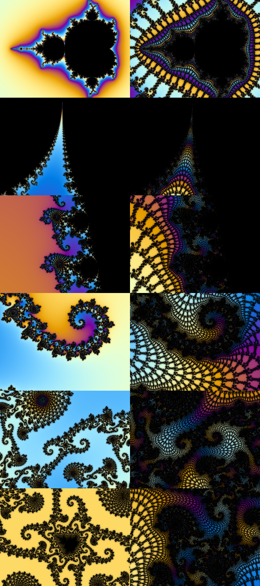
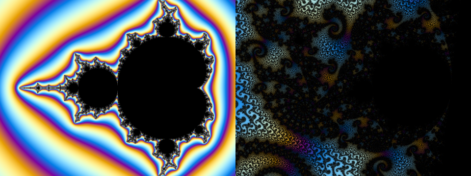
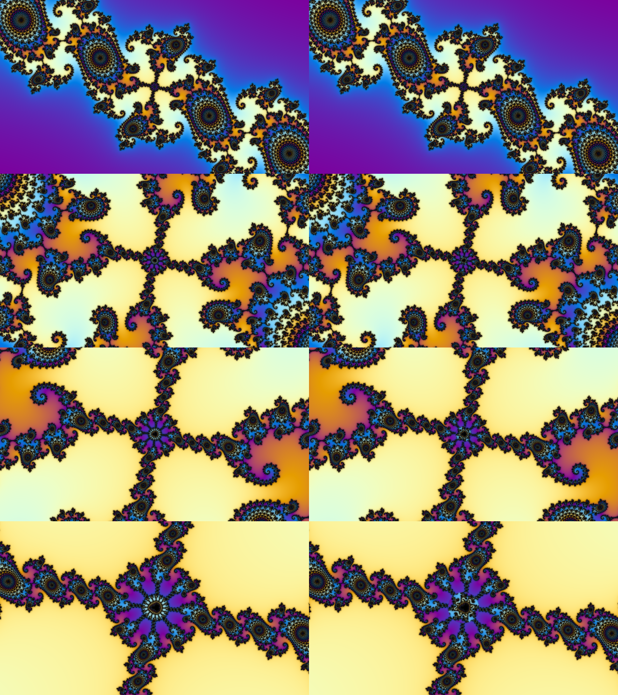
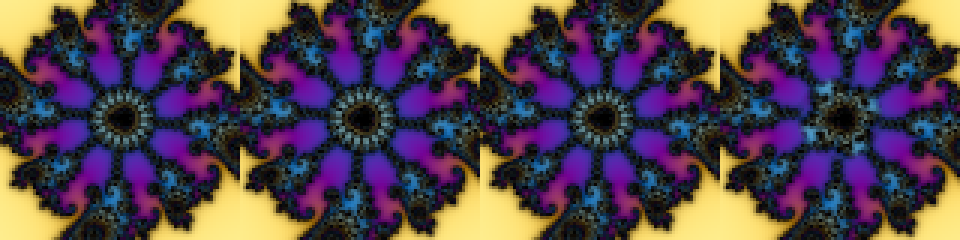

# Findings so far

Goal (north star): Mandelbrot zoom videos that feel endless, look as legit as the best deep
zooms, and cost the same per frame at minute 60 as at minute 1 on a laptop. Exactness is
optional; passing a blind A/B test is not (DEC-01).

## PoC 1: minibrot splice (does a minibrot really match the whole set?)

Every island minibrot is a near-copy of the set: `c ≈ c0 + s·C`, where `c0` is its nucleus
and `s` is a complex size (magnitude = scale, angle = rotation). Rendering the same local
view `C` in both worlds:

- **Shape matches.** Period-35 mini (|s| = 1.4e-10): inside/outside agreement 99.8–99.99% at
  every relative depth from 3 to 3e-5.
- **Texture doesn't.** The mini is wrapped in a fine *lace* of filaments (the visual trace
  of its surroundings). The main set has smooth colour fields there. The lace does not fade
  with depth. A plain "cut back to the main set" is visible.
   (left: main set, right: real mini)
- **Gotcha:** ball-period search also finds *satellite bulbs*, which are not copies of the
  set. The p=936 "mini" near the seahorse point was a period-12 satellite of a p=78
  component. `minis.validate` renders each candidate against the main set and rejects
  < 97% agreement (DEC-03). 
- Plain double precision gives noise at these depths; perturbation around the nucleus fixes
  it, and the nucleus orbit is exactly periodic, so the reference is p numbers, computed
  once (DEC-03).

## PoC 2: hide the teleport while it is tiny (user's idea)

Swap the region around a deep mini A for a shallower twin B while the patch is a few
percent of the screen, then keep zooming in B's coordinates (DEC-02).

Mismatch at the swap moment (640×360, `measure.py`):

| patch width | colour change inside patch | pixels changed > 10% |
|---|---|---|
| 1% | 3.7% | 0.00% |
| 3% | 9.5% | 0.05% |
| 5% | 13.3% | 0.17% |
| 10% | 18.7% | 0.91% |

### Blind round 1 — failed (caught)
Hard cut at 4% of width, nearest twin (p=39). The user named the fake **and the exact frame
(143)**. Cause: the real mini's bright beaded lace ring vanished in one frame.
 (real 142, real 143, fake 142, fake 143)
Clips: `tests/blind/round1/` (mapping clip_1 = A, clip_2 = B in answer.txt).

### Blind round 2 — passed
Swap at 1.2% of width (~8 render pixels), 10-frame smoothstep fade, feathered patch, twin
chosen as best of 1,935 validated islands (best p=34 mismatch 4.91% vs 6.72% for the
nearest twin). The user **could not tell which clip was fake**.
Clips: `tests/blind/round2/`.

## Known limits / open questions
- One viewer, one swap, one location, one palette, 640×360 upscaled to 720p.
- The threshold that matters is **pixels**, not percent: at 4K, 1.2% is ~46 px and lace
  would resolve. Swap while the patch is ≲ 10 output pixels.
- No speed win demonstrated yet. The slow frames (~30 s each at the end of round 1) came
  from a parabolic seahorse-valley region deep inside one segment; chained swaps should keep
  segments shallow (POC-02), and BLA/GPU should cut hard-region cost (PERF-01).
- Swaps reset lace to 1–2 layers; true 1e-1000 evolution zooms look more ornate (POC-03).
- The twin search took ~1 hour for one target; needs a reusable library (LIB-01).
