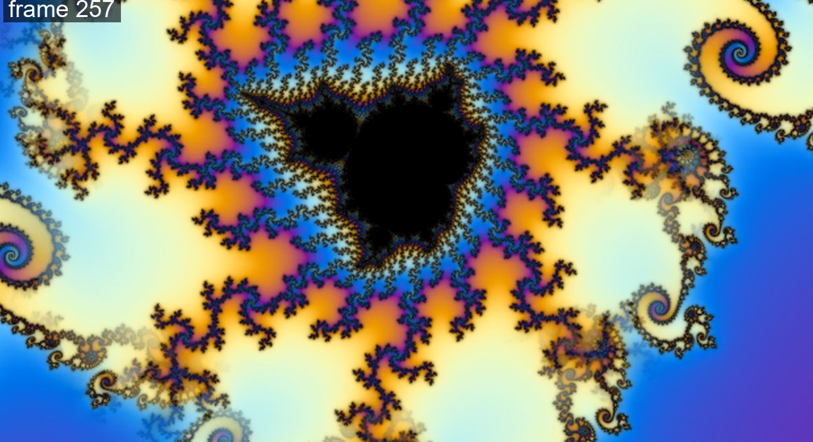
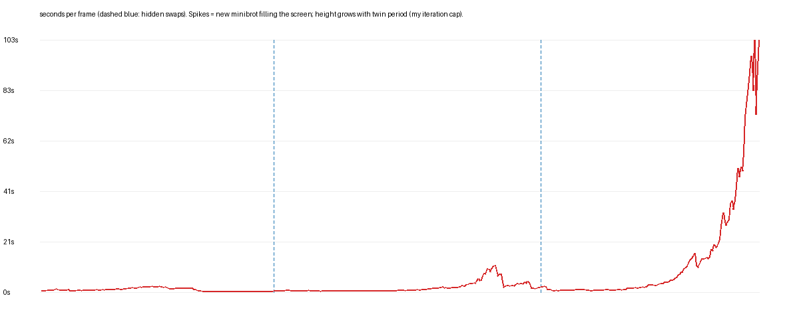

# Handoff — 2026-10-05

Start the next session with `ishoo_status`, then read this file and `docs/FINDINGS.md`.

## The goal
Mandelbrot zoom videos that feel endless, look as legit as the best deep zooms, and cost
the same per frame at minute 60 as at minute 1 on a laptop (RTX 3050 Ti, 20 CPU threads).
Mathematical exactness is optional; passing a blind A/B test is not (DEC-01).

## The core idea (DEC-02)
Every island minibrot is a near-copy of the whole set (`c ≈ c0 + s·C`, complex `s` = size
and rotation). So instead of zooming ever deeper, zoom toward a minibrot and, while it is
only a few pixels wide, quietly swap in a *shallower twin* that looks the same, then keep
zooming in the twin's coordinates. True depth never accumulates. Each segment renders by
perturbation around its own minibrot's nucleus, whose orbit is exactly periodic, so the
reference costs p numbers once and nothing per frame (DEC-03).

## Results so far

| Experiment | Result | Evidence |
|---|---|---|
| PoC 1: does a minibrot match the set? | Shape 99.8–99.99% identical at every depth; outer "lace" texture differs, so cutting back to the main set is visible | `docs/img/depthcheck_p35.png` |
| Satellite trap | Ball-period search also finds satellite bulbs; validator rejects < 97% agreement | `docs/img/mapcheck_p936.png` |
| Blind round 1 | Hard cut at 4% width — **user caught it at the exact frame (143)** | `tests/blind/round1/` |
| Blind round 2 | Swap at ~8 px, 10-frame fade, best twin of 1,935 — **user could not tell** | `tests/blind/round2/` |
| Twin library (LIB-01) | Pick a matched twin in **12 s** (was ~1 h), same best match (4.91%) | `python -m fractadactyl.library pick ...` |
| PoC 3 chain (partial) | 483 frames, **2 chained swaps**, worlds never deeper than 2.1e-9, twins 2.0–4.7% mismatch, each swap adds a natural rotation | `tests/blind/round3/` |

## Round 3: what went wrong (must fix before the next blind test)
The user reviewed the partial chain clip and found two visible defects, plus a cost problem.

1. **Ghost ring (visible).** The patch edge was feathered over 40% of the patch radius in
   *mini-local* units. Once the patch grows past a few pixels, that band becomes a wide
   ring where both worlds show at half opacity — spirals double-exposed.
   
   **Fix:** feather only ~2–3 *screen* pixels, and place the seam where the two worlds
   already agree most (panorama-stitching "optimal seam": dynamic programming over angle in
   mini-local polar coordinates, computed once so the seam is fixed in world space and
   zooms with the scene).
2. **Lateral shift at segment handoff (~frame 284).** Each segment zooms toward its own
   target Q; after switching to the twin's coordinates the new target can differ from the
   old fixed point by up to ~10% of the screen, so the zoom direction jumps. The handoff
   frame also skips one camera step.
   **Fix:** plan targets backwards so the chain aims at one nested point:
   `Q_last = P_last; Q_k = CM_k + sigma_k * Q_{k+1}`; apply the camera step on the handoff
   frame too.
3. **Cost climbed with twin period, not depth.** Mean seconds/frame by segment: **1.0 →
   4.4 → 55** (worst frame 121 s). Cause: `maxiter = 5000 × period`, and pixels near a
   minibrot's cusps never settle, so they run to a cap that grows with the twin's period.
   **Fix:** period-independent iteration cap tied to pixel size, plus a derivative-based
   interior test; optionally prefer low-period twins. Then PERF-01 (BLA/GPU).
   

Already fixed in the WIP code: `pert.render(..., need=mask)` skips pixels nobody will see
(swap-window frames 22 s → ~4 s), and plans are cached between runs.

## Code state
- `fractadactyl/` package: `pert` (nucleus perturbation renderer, now with a visibility
  mask), `minis` (find + validate), `library` (twin library), `twins`, `swap`, `color`, `mb`.
- `fractadactyl/chain.py` + `experiments/poc3_chain/run.py`: **work in progress** — the
  chain engine that produced round 3. It has the three defects above. Also preserved as
  branch `ishoo/POC-02` (commit `eacbfcd`).
- `data/twins.npz` (twin library, 10 MB) is **not committed**; rebuild with
  `python -m fractadactyl.library build --budget 0 --seed-from data/poc2_twins.pkl` (~3 min).
- Large frame dumps live in the session temp folder only.

## Lessons for the next session
- **Show the user something every ~20 minutes.** Long silent renders burned an afternoon.
  Render a short low-res preview of each new idea first; only then do full quality.
- Look at real frames at full size before calling anything done; the ghost ring was
  visible in a single still.
- Pass coordinates as `--seed=...` (a leading minus breaks argparse).
- Every new Ishoo worktree drops stray git-lfs hook copies in its root; they are listed in
  `.git/info/exclude` on this machine.

## Next steps, in order
1. **POC-02** — fix the ghost ring, the handoff shift and the iteration cap; render a
   **short low-res preview** of one swap and show it; then the full ≥ 30 s, ≥ 4-swap chain,
   timing chart vs the real-depth control, and the user's spot-the-swap test.
2. **PERF-01** — BLA over the periodic reference and/or GPU kernel for cusp regions.
3. **FX-01** — make the per-swap rotation a deliberate spin.
4. **POC-03** — keep more lace layers so long zooms look as ornate as true deep zooms.
5. **PROD-01** — 4K, palettes, pixel-based swap thresholds verified at 4K.
