# Can Genuine Mandelbrot Deep Zooms Approach Depth-Independent Per-Frame Cost?

## Executive summary

**Verdict: yes, but only in a carefully defined sense.** A genuine Mandelbrot zoom can plausibly approach **depth-independent *online* per-frame raster cost** along a coherent, preselected movie path when substantial depth-dependent work is moved into persistent state and offline precomputation. It cannot, in general, make the **total computation**, the **cold-start cost of an arbitrary frame**, or the amount of **information needed to specify a generic depth-\(D\) location** independent of depth.

The central distinction is between three costs:

\[
\boxed{
T_{\rm project}
=
C_{\rm precompute}(D_{\max})
+
\sum_{f=1}^{F}T_{\rm warm}(f)
}
\]

versus the cost of rendering a completely independent frame,

\[
T_{\rm cold}(D),
\]

and the warm online cost once a movie-wide hierarchy, references, and local maps already exist,

\[
T_{\rm warm}(D).
\]

For a fixed raster size and fixed numerical/error target, existing perturbation renderers have already moved most arbitrary-precision arithmetic out of the per-pixel loop: one high-precision reference orbit supports a large number of low-precision perturbations. K. I. Martin's 2013 method introduced the now-standard recurrence and series acceleration, explicitly arguing that rendering could become “largely independent” of depth and iteration count; Claude Heiland-Allen subsequently formalized perturbation and series calculations and current renderers build on that foundation. The perturbation recurrence itself is algebraically exact; approximation enters through finite arithmetic, series truncation, BLA, and related skips. citeturn19search2turn21view7turn21view6

Modern evidence goes substantially further. A current WebGL implementation reports that series approximation skips about 92% of raw iterations at binary depth \(D=500\), with a measured 6–13× GPU speedup across \(2^{-120}\) through \(2^{-400}\); at \(2^{-400}\), caching the reference and series coefficients changes a roughly 0.58-second cold frame into roughly 0.10-second subsequent zoom frames. Its CPU BLA reduces retained work another 2.5–3.3×, although its GPU BLA is actually 1.6–2× *slower* because random table traffic and warp divergence overwhelm the saved arithmetic. citeturn23view0turn23view1turn22view1 A separate WebGPU renderer reports a second-order approximation skipping 96.9% of iterations and giving 21× acceleration at \(2.8\times10^{40}\) magnification. citeturn22view8 These are author-reported implementation benchmarks rather than standardized cross-renderer tests, but they demonstrate that enormous raw iteration counts need not translate proportionally into frame time.

There are nevertheless real depth taxes. If a frame center near \(|c|=O(1)\) is represented directly in global coordinates and the viewport width is \(O(2^{-D})\), then resolving individual pixels requires

\[
p \ge D+\log_2 W+O(1)
\]

bits in the center/reference coordinate. That \(\Omega(D)\) information requirement is unavoidable for a generic explicitly represented center. MPFR and other arbitrary-precision packages can supply such precision, but arithmetic becomes more expensive as \(p\) rises. citeturn21view7turn15view2 Current extreme-zoom renderers explicitly report high-precision reference construction becoming the dominant cost; FractalShark consequently implements GPU high-precision reference generation with NTT-based multiplication and reports roughly a 10× advantage over its multithreaded MPIR/AVX2 path at about 158,000 decimal digits on an RTX 4090. citeturn22view4turn22view5

Depth can also correlate with **genuinely increasing dynamical time**, sometimes far more severely than linearly. At the \(c=1/4\) parabolic cusp, writing \(c=1/4+\delta\) and \(w=z-1/2\) gives exactly

\[
w_{n+1}=w_n+w_n^2+\delta .
\]

Classical parabolic bifurcation theory gives a transit of order \(N\sim\pi/\epsilon\) for a perturbation \(\delta=\epsilon^2\). Hence, if \(|\delta|\asymp2^{-D}\), the unsimplified orbit can require

\[
N(D)\asymp\pi 2^{D/2}.
\]

That scaling follows directly from the Lavaurs asymptotic stated in the parabolic-bifurcation literature. citeturn15view1turn18view1 Similarly, at a stationary renormalization point, Lyubich proved parameter scaling \(|c_n-c_*|\sim b\lambda^{-n}\), while the relevant superattracting periods are \(p^n\). Thus at binary depth \(D\approx n\log_2\lambda\),

\[
q(D)
\asymp
2^{D\,\log_2p/\log_2\lambda}.
\]

For period doubling, using the familiar \(\lambda\approx4.6692\), the exponent is about \(0.450\). citeturn17view0turn18view0turn16search1

Those iteration-growth laws are **not universal lower bounds on rendered-frame time**, however. A parabolic transit can in principle be represented by a Fatou/Lavaurs transition map; a period-\(q\) return can be represented by a precompiled local return map; BLA already does exactly this idea at first order for ordinary orbit segments. Claude Heiland-Allen's BLA construction merges neighboring affine perturbation maps into powers-of-two blocks, producing only \(O(N)\) table entries for an \(N\)-step reference and greedily taking the largest valid block. citeturn23view5 Second-order segment maps have now been demonstrated in a GPU renderer, supporting the proposition that higher-order compiled maps can trade offline compilation and storage for dramatically fewer online iterations. citeturn22view8

The strongest conclusion from the research is therefore:

> **There is no known universal theorem forcing \(\Omega(D)\) arithmetic per output frame when the path is known in advance, persistent state and arbitrary precomputation are permitted, and the objective is a numerically valid finite-resolution raster rather than exact Mandelbrot membership.** What is unavoidable is that depth-dependent information and difficult dynamics have to be paid for *somewhere*: in path specification, atlas construction, high-precision reference work, map certification, storage, or exceptional fallback computation.

For offline video this distinction is unusually favorable. A conventional zoom movie has a roughly fixed number of frames per octave, so \(F=\Theta(D_{\max})\). Even an unavoidable \(O(D_{\max})\) amount of coordinate/chart metadata therefore amortizes to \(O(1)\) per frame. The harder question is whether reference/return-map construction can likewise be made close to linear in movie length rather than proportional to the raw deep orbit period. Existing BLA, series, reference reuse, rebasing, orbit compression, Newton period finding, and experimental nested-minibrot techniques strongly suggest a path to doing so, but a fully general, rigorously certified **renormalization-atlas video renderer** does not yet appear among the mature implementations reviewed here. Claude's experimental NanoMB work is the closest explicit attempt at chaining successively deeper minibrot coordinates, and the author notes that the multi-level scheme remains experimental and fails at some locations. citeturn5search1

## Definitions and assumptions

The quadratic Mandelbrot set is

\[
M=\{c\in\mathbb C:
z_0=0,\quad z_{n+1}=z_n^2+c
\text{ remains bounded}\}.
\]

This is the formulation used in the original perturbation material and current deep-zoom implementations. citeturn21view7turn21view3

**Depth.** Let a reference full-view linear span be \(s_0\), and let a frame have span \(s\). Define

\[
Z=\frac{s_0}{s},\qquad
D_2=\log_2 Z,\qquad
D_{10}=\log_{10}Z.
\]

Thus a viewport whose linear extent is \(2^{-1000}\) of the base scale has binary depth \(D_2=1000\). Changing \(s_0\) only adds a constant to \(D\), so asymptotic statements are unaffected.

For a width of \(W\) pixels, the parameter-plane spacing is approximately

\[
h \asymp \frac{s}{W}
       = \frac{s_0\,2^{-D}}{W}.
\]

A **genuine deep zoom**, for this report, means that the dynamics associated with points separated at this scale are actually evaluated, approximated under controlled error, or obtained from previously compiled representations of those dynamics. Merely enlarging a previously rendered bitmap does not qualify. Reusing an orbit, a return map, a local-coordinate chart, or a prior frame as a *preview* does qualify provided the final samples are regenerated or certified at the requested scale. Current browser implementations make exactly this distinction: frame reprojection is used for immediate feedback while the sharp deep render follows. citeturn22view0

**Per-frame cost.** It is useful to decompose it as

\[
T_{\rm frame}
=
T_{\rm camera}
+
T_{\rm reference}
+
T_{\rm compile/update}
+
T_{\rm pixels}
+
T_{\rm memory/I/O}
+
T_{\rm output}.
\]

A conventional perturbation renderer makes \(T_{\rm reference}\) expensive but shares it across all pixels; series or BLA moves portions of \(T_{\rm pixels}\) into \(T_{\rm compile/update}\); movie-wide caching can move both outside individual frames. citeturn21view3turn23view5

Three notions of “depth independent” must not be conflated:

| Cost notion | Definition | Can it plausibly become depth-independent? |
|---|---|---|
| **Cold independent frame** | Frame at depth \(D\) arrives with an explicit absolute center and no cache | **No in the strict bit model:** the generic center itself needs \(\Omega(D)\) bits. |
| **Warm sequential frame** | Previous references/charts/cache remain resident | **Yes, approximately**, if the new frame stays inside a valid local atlas and residual work remains bounded. |
| **Offline amortized video** | \(\big(C_{\rm pre}+\sum T_f\big)/F\) for a predetermined sequence | **Most promising.** Depth-dependent setup can be spread over many coherent frames. |

I use **depth-independent per-frame cost** to mean \(T_{\rm warm}(D)=O(P)\) for a fixed number \(P\) of output samples, fixed visual/numerical error criteria, and a fixed hardware model, with the hidden constant not systematically increasing with absolute depth. It does **not** mean the total project precomputation is depth independent.

The following assumptions resolve parameters the request leaves unrestricted.

| Quantity | Assumption used here |
|---|---|
| Maximum zoom depth | **No specific constraint.** Both asymptotic \(D\to\infty\) reasoning and finite current implementations are considered. |
| Resolution | **No specific constraint.** Complexity is stated in terms of \(P=W H\); comparisons hold \(P\) fixed when studying depth. |
| Accuracy | No specific numeric tolerance; enough coordinate and dynamical precision to make pixel-scale errors negligible relative to \(h\), with validation against higher precision where required. |
| Exact membership | **Not required.** A finite raster cannot generally establish infinite-time boundedness for every boundary point; practical renderers use finite iteration or other termination criteria. FractalShark explicitly describes visual membership as necessarily approximate in this sense. citeturn21view2 |
| Frame coherence | No constraint globally. Both arbitrary jumps and the more favorable nested/coherent zoom path are analyzed. |
| Precomputation | **No specific constraint**, and for the proposed offline architecture it may be very large. |
| Real-time requirement | None, as specified by the question. |
| CPU/GPU | No specific constraint; asymptotics use a word/bit-cost model and empirical evidence uses the hardware reported by each implementation. |
| RAM/disk | No specific limit; memory and I/O are nevertheless charged as costs. |
| Coloring | Escape-time/smooth coloring is the baseline; extra supersampling, distance estimation, or shading multiplies \(P\) or adds derivatives but does not change the fundamental depth argument. |

A useful variable dictionary for the rest of the report is \(D\) = binary depth, \(p\) = significand/coordinate precision in bits, \(N\) = ordinary reference or dwell iterations, \(q\) = a detected dynamical period, \(k\) = approximation order, \(J\) = accepted compiled macro-steps per pixel, and \(P\) = rendered samples.

## Mathematical scaling and unavoidable lower bounds

The first important result is that **depth and iteration count are distinct variables**. There is no universal function \(N=N(D)\). Different dynamical regimes produce radically different relationships.

**Expanding-orbit model.** Suppose locally the response of an \(n\)-step orbit to a parameter perturbation grows approximately as

\[
\left|\frac{\partial z_n}{\partial c}\right|
\asymp e^{\chi n}
\]

with \(\chi>0\). A pixel perturbation \(|\delta c|\asymp2^{-D}\) becomes order one when

\[
e^{\chi n}2^{-D}\asymp1,
\]

so

\[
n \approx \frac{\ln2}{\chi}D.
\]

Thus ordinary expanding regions naturally produce roughly **linear iteration growth with binary depth**. The derivative recurrence behind this model,

\[
\frac{\partial z_{n+1}}{\partial c}
=2z_n\frac{\partial z_n}{\partial c}+1,
\]

is part of the standard perturbation formulation. citeturn21view7 This is a conditional local model, not a theorem that every zoom has \(N=\Theta(D)\).

**Parabolic model.** At the main-cardioid cusp \(c=1/4\),

\[
c=\frac14+\delta,\qquad z=\frac12+w
\]

transforms the Mandelbrot recurrence *exactly* into

\[
w_{n+1}=w_n+w_n^2+\delta.
\]

Set \(\delta=\epsilon^2\). The classical Lavaurs scaling says that a perturbation of \(f(w)=w+w^2+O(w^3)\) has a nontrivial parabolic transition after \(N_\epsilon\) iterations satisfying

\[
N_\epsilon-\frac{\pi}{\epsilon}\to0.
\]

citeturn15view1turn18view1 Consequently a path with \(|\delta|\asymp2^{-D}\) has a raw parabolic transit

\[
N(D)\sim\pi2^{D/2}.
\]

This is a rigorous demonstration that some geometrically natural deep paths can have iteration requirements vastly worse than linear depth.

**Renormalization model.** Lyubich's universality theorem for stationary bounded-type renormalization gives superattracting parameters of period \(p^n\) approaching the limiting parameter with

\[
|c_n-c_*|\sim b\lambda^{-n}.
\]

citeturn17view0turn18view0 If viewport scale follows these little copies, then

\[
D\simeq n\log_2\lambda+O(1)
\]

and hence

\[
q=p^n
   \asymp
   2^{\left(\frac{\log_2p}{\log_2\lambda}\right)D}.
\]

For period doubling \(p=2\) and the usual parameter scaling constant \(\lambda\approx4.6692\), this is approximately

\[
q(D)\asymp2^{0.450D}.
\]

The modern mathematical literature continues to describe the \(\approx4.6692\) spatial scaling at the period-doubling Feigenbaum Mandelbrot point. citeturn16search1 Again, this is growth of the **natural period**, not yet a lower bound on a renderer that is permitted to evaluate a compiled return map.

The following lower bounds are more fundamental.

**Global-coordinate precision lower bound.** Consider a generic center \(c\) of \(O(1)\) magnitude and a viewport span \(s_0 2^{-D}\). Pixel spacing is \(h\simeq s_0 2^{-D}/W\). Suppose the center must have absolute error at most \(\alpha h\), with fixed \(\alpha<1\). A \(p\)-bit ordinary binary representation near unit magnitude has granularity on the order of \(2^{-p}\), so necessarily

\[
2^{-p}\lesssim \alpha\frac{s_0 2^{-D}}{W},
\]

or

\[
\boxed{
p\ge D+\log_2W+O(1).
}
\]

This makes precise Heiland-Allen's observation that deep zooming requires enough numerical information to distinguish nearby points. citeturn21view7 In decimal depth \(D_{10}\),

\[
p\ge D_{10}\log_2 10+\log_2W+O(1)
\approx3.322D_{10}+\log_2W+O(1).
\]

Therefore an arbitrary global-coordinate renderer cannot erase the depth tax everywhere: **at least one representation of a generic depth-\(D\) target needs \(\Omega(D)\) bits.** MPFR's variable-precision model is one practical way to carry these bits. citeturn15view2

This also gives an input-cost lower bound. On a \(w\)-bit word machine, ingesting a fresh generic \(p=\Theta(D)\)-bit center takes \(\Omega(D/w)\) word accesses. But that is a **cold-frame** bound. A persistent path-specific renderer can store the long global-coordinate prefix once and subsequently express frames by fixed-size local offsets.

There is a smaller asymptotic caveat even for local coordinates: if absolute depth itself becomes unbounded and must be encoded explicitly as an exponent, representing the integer \(D\) requires \(\Theta(\log D)\) bits. Fixed 32- or 64-bit exponent schemes hide this over an enormous finite range, but literal \(O(1)\) cost for unbounded \(D\) ultimately depends on the computational model. Current deep renderers routinely separate mantissa from an explicit exponent specifically to avoid the much larger mantissa-depth cost in per-pixel deltas. citeturn22view7turn23view1

**Fresh dense-reference lower bound.** If an implementation insists on generating \(N\) successive \(p\)-bit reference states from scratch, each dense arbitrary-precision step has to produce/touch \(\Omega(p)\) bits; conventional multiplication costs at least linear time in operand size. Thus even before choosing a practical multiplication algorithm,

\[
T_{\rm fresh-ref}=\Omega(Np)=\Omega(ND)
\]

in a bit-operation/data-movement sense. Real arbitrary-precision multiplication adds its own nonconstant \(M(p)\) cost, so the conventional formulation is roughly

\[
T_{\rm ref}=O(N\,M(p)).
\]

This is an algorithmic lower bound **for dense fresh reference evaluation**, not a universal theorem about all possible representations: periodicity, compressed orbits, return maps, or precomputation can change the problem being evaluated.

**Exact-iterate algebraic lower bound.** Define

\[
P_n(c)=f_c^n(0).
\]

Then

\[
\deg P_1=1,\qquad
P_{n+1}=P_n^2+c,
\]

hence by induction

\[
\deg P_n=2^{n-1}.
\]

Now consider an exact straight-line arithmetic program starting from \(c\) and constants and using \(+,-,\times\). After \(m\) multiplication gates, the largest possible polynomial degree is at most \(2^m\): each multiplication can at most add the degrees of its two inputs, and repeated squaring is the fastest degree growth. Therefore computing the generic exact polynomial \(P_n(c)\) requires

\[
\boxed{m\ge n-1}
\]

multiplications. Combining this with a path on which the necessary raw iterate count is \(n=\Theta(2^{D/2})\) yields a corresponding exact-generic evaluation lower bound. The escape hatch is important: a precomputed local transition map is no longer evaluating the full degree-\(2^{n-1}\) polynomial from scratch in the same circuit model; it is evaluating a compressed representation valid on a restricted domain.

That observation explains why parabolic/renormalization iteration growth does **not** prove a depth-dependent lower bound for path-specialized rendering.

Finally, every renderer has an unavoidable depth-*independent* floor:

\[
\boxed{T_{\rm output}=\Omega(P)}
\]

because \(P\) output samples or pixels must be produced. The ideal deep-zoom architecture is therefore not “zero cost at arbitrary depth” but rather **approaching this \(O(P)\) raster floor after precomputation.**

## Prior art and how current renderers work

The modern deep-zoom lineage starts with Martin's perturbation identity. For a high-precision reference orbit \(Z_n\) at parameter \(C\), and a nearby parameter \(C+\delta c\), write the nearby orbit as \(Z_n+\delta z_n\). Algebra gives

\[
\boxed{
\delta z_{n+1}
=
2Z_n\delta z_n
+
(\delta z_n)^2
+
\delta c .
}
\]

The identity is exact before rounding. Only the reference \(Z_n\) needs the deep absolute coordinate; \(\delta z\) and \(\delta c\) can often remain low precision. Martin then represented the perturbation by a power series in \(\delta c\); Heiland-Allen derived the corresponding coefficient recurrences and emphasized that the coefficients depend on the reference but not on the individual pixel, so they can be reused throughout an image. citeturn19search2turn16search6

Series approximation therefore acts as a **compiled prefix**. A polynomial

\[
\delta z_n
\approx
A_n\delta c+B_n\delta c^2+C_n\delta c^3+\cdots
\]

can jump directly to some iteration \(n\) for every pixel in the local region. Its limitation is that coefficient growth eventually makes the neglected terms too large, ending the valid skip. citeturn16search6

Zhuoran's later **rebasing** technique attacks a different problem. When a perturbed orbit approaches the critical point and cancellation would destroy its low-precision significance, the pixel is re-expressed relative to the beginning of the reference orbit. Heiland-Allen describes this as allowing one critical-point reference to be reused instead of accumulating glitch references. citeturn21view5 Series approximation and rebasing are therefore highly complementary: one skips a long common prefix, while the other keeps later perturbation arithmetic numerically meaningful.

**BLA terminology deserves a correction.** In the deep-zoom sources reviewed here, BLA means **bivariate linear approximation**, and Claude Heiland-Allen's early writing also calls it **bilinear approximation**. It is not normally expanded as “binary” or “ballistic linear approximation.” Its data structure *is* binary/doubling-based, which may be the source of that terminology. citeturn23view5

BLA drops the quadratic perturbation term locally and represents a segment as

\[
\delta z_{m+\ell}
\approx
A\,\delta z_m+B\,\delta c,
\]

plus a radius in which the approximation is accepted. Neighboring segments are composed; one-step blocks form two-step blocks, then four-step blocks, and so on. For an \(N\)-step reference, the complete hierarchy has fewer than \(2N\) entries. At runtime the renderer takes the longest valid segment and falls back to ordinary perturbation where no block is safe. citeturn23view5 Algorithmically, this is very close to a **segment tree/binary-lifting compilation of the orbit**.

A current WebGPU implementation takes the next natural step: it stores **second-order terms** as well as the affine \(A,B\) terms. Moving the first omitted term from quadratic to cubic widens the admissible perturbation region; its author reports 96.9% iteration skipping and 21× acceleration at \(2.8\times10^{40}\) magnification. citeturn22view8 This is especially significant for the question here: first-order BLA need not be the endpoint. A hierarchy of order-\(k\) local maps is a plausible bridge from current BLA to genuine compiled return maps.

**Rescaled/floatexp arithmetic** addresses dynamic range rather than mantissa depth. Writing

\[
\delta z=S w,\qquad
\delta c=S d
\]

changes the perturbation recurrence to a form such as

\[
w\mapsto2Zw+S w^2+d,
\]

allowing \(w\) to stay near unit scale while \(S\) carries a large exponent. Heiland-Allen describes this as a cheaper alternative to performing every operation in an extended-exponent number format. citeturn19search1 Current GPU implementations likewise use mantissa-plus-explicit-exponent deltas because the perturbation may start around \(10^{-60}\) and later become order one. citeturn22view7

**Compensated and multiword floating point** are a separate axis. Dekker's classical construction expresses extended precision in multiple ordinary floating-point components through error-free transforms; double-double and quad-double libraries generalize the idea. citeturn20search0turn20search2 In Mandelbrot implementations, the same design space appears as double-single/df64 and double-double-like GPU formats. The Phylliida renderer, for example, uses a two-float “df64” representation with roughly 46 effective mantissa bits in part of its GPU path. citeturn23view1 Such formats are useful for medium precision but do not remove the eventual \(p=\Theta(D)\) requirement for an absolute global reference.

**Period/nucleus finding** is another major form of compression. Fraktaler can lock the maximum reference length to a known period after Newton zooming, which can substantially reduce work in high-iteration regions. citeturn22view2 FractalShades combines arbitrary-precision references with ball-method period search, Newton searches, perturbation, and chained bilinear approximations. citeturn6search7 This is already a practical use of local periodic structure, although it generally stops short of compiling \(f^q\) itself into a validated nonlinear return map.

**Reference reuse is now explicit movie infrastructure.** Fraktaler can reuse the same reference throughout a zoom-out sequence, avoiding a reference rebuild at each frame; its documentation cautions that BLA reuse is harder because BLA validity depends on zoom depth. citeturn22view2 The Phylliida implementation goes further for nested zoom-in frames: it retains both the reference and series coefficients because the smaller \(\delta c\) box remains inside the already validated larger one, refreshing periodically rather than every frame. citeturn22view1

**Orbit compression** attacks the \(O(N)\) memory side. FractalShark implements reference compression inspired by Zhuoran's work and treats reference computation as the main bottleneck at sufficiently extreme depths. citeturn22view5turn22view6 This becomes important once \(N\) or \(q\) reaches hundreds of millions: even if arithmetic is cheap, storing one record per raw iteration can dominate memory and disk traffic.

**Hierarchical local-coordinate/renormalization ideas exist, but are not yet a mature mainstream pipeline.** Lyubich's theory gives the rigorous mathematical foundation for nested quadratic-like renormalizations and asymptotic local rescaling. citeturn17view0turn18view0 On the renderer side, Heiland-Allen's experimental NanoMB work explores chains of successively deeper minibrots, performing computations in the deepest scale and rebasing toward outer structures; the author explicitly describes the multi-level scheme as experimental and notes failure modes. citeturn5search1 In the sources reviewed, I found no production renderer that fully converts a nested renormalization tower into a rigorously error-bounded movie-wide chart atlas.

The practical design space can be summarized as follows. \(M(p)\) denotes the cost of \(p\)-bit multiplication.

| Method | Offline/pre-frame work | Memory | Nominal frame/pixel work | Remaining depth dependence | Video suitability |
|---|---:|---:|---:|---|---|
| Direct multiprecision per pixel | Minimal | \(O(p)\) per worker | \(O(PN M(p))\) | \(p=\Theta(D)\), often \(N=N(D)\) | Poor |
| Perturbation + one reference | \(O(NM(p))\) reference | Usually \(O(N)\) reduced reference samples | \(O(PN)\) low-range arithmetic | Reference still pays \(p(D)\); raw \(N\) remains | Very good |
| Series approximation, fixed order \(k\) | For fixed \(k\), \(O(N)\); generically coefficient convolution is roughly \(O(Nk^2)\) | \(O(k)\) per checkpoint, or more if many checkpoints | \(O(P(k+N_{\rm residual}))\) | Valid prefix eventually ends | Excellent for nested zooms |
| Rebasing | Reference already required | Negligible extra | Small test plus occasional reset | Does not itself skip iteration count | Essential companion to perturbation |
| First-order BLA | \(O(N)\) block construction | \(O(N)\); full hierarchy <\(2N\) blocks citeturn23view5 | \(O(P(J+N_{\rm fallback}))\) | Table size follows reference; validity location dependent | Excellent on CPU; mixed on GPU |
| Higher-order BLA/Taylor segments | Higher, roughly polynomial in \(k\) | \(O(k)\) coefficients/block | \(O(PkJ)\) | Conditioning and coefficient growth | Very promising offline; second order already demonstrated citeturn22view8 |
| Period-locked reference | Newton/period search plus \(q\)-orbit | \(O(q)\) | Perturbation against repeating reference | \(q\) itself may grow rapidly | Excellent when a stable nucleus exists |
| Compiled nonlinear return map \(f^q\) | Potentially expensive high-order/validated composition | Coefficients + validity bounds | A few polynomial/rational evaluations per return | Map order/domain may grow; largely unexplored in renderers | Potentially excellent |
| Renormalization/local-chart atlas | Potentially very high and path-specific | Depth-dependent atlas | Ideally \(O(PJ)\) with bounded \(J\) | Tax migrates to atlas construction/storage | **Best theoretical fit for offline video** |
| Movie-wide reference/SA cache | One-time reference/coefficients | RAM/disk cache | Removes or greatly reduces frame setup | Refresh at validity boundaries | Already demonstrated citeturn22view1 |
| Extended exponent/rescaling | Small | Constant per state | Constant-factor arithmetic | Exponent metadata eventually grows; no mantissa-depth fix | Very good |
| GPU arbitrary-precision reference | High implementation complexity | Big-number state + orbit output | Reduces \(T_{\rm reference}\), not \(N\) | Precision work still grows | Excellent at extreme depth citeturn22view4 |
| Tiled/strip streaming | Scheduling | Bounded working set | Similar arithmetic plus orchestration | Does not change mathematical complexity | Important for GPUs/watchdogs citeturn22view1turn22view2 |

The relevant implementations are unusually diverse. [SuperFractalThing](https://sourceforge.net/projects/suprfractalthng/) is the historical perturbation/series implementation. [Fraktaler 3](https://fraktaler.mathr.co.uk/) implements contemporary perturbation/BLA, CPU/OpenCL paths, Newton zooming and sequence rendering. [Imagina](https://github.com/5E-324/Imagina) contains Zhuoran's high-performance deep-zoom work and linear-approximation machinery. citeturn9search0 [FractalShades](https://github.com/GBillotey/Fractalshades) provides arbitrary-precision reference/period/Newton/perturbation/chained-BLA infrastructure. citeturn6search3turn6search7 [FractalShark](https://github.com/mattsaccount364/FractalShark) explores CUDA rendering, GPU high-precision references, compression, and linear approximation. citeturn22view4turn22view5 [mandelbrot-webgpu](https://github.com/Desarso/mandelbrot-webgpu) implements GPU arbitrary precision and second-order segment skipping. citeturn21view3turn22view8 [Phylliida/fractal](https://github.com/Phylliida/fractal) is particularly useful as a heavily instrumented series/BLA/cache/tiling experiment. citeturn21view0

## Performance evidence, interactions, and the remaining depth tax

The empirical literature is much thinner than the algorithmic literature. There is no accepted Mandelbrot deep-zoom benchmark suite with standardized locations, error tolerances, dwell policies, precisions, cache state, and hardware. Consequently the numbers below should be treated as **within-implementation evidence**, not as a ranking between programs.

| Implementation / experiment | Hardware and case | Reported result | What it demonstrates |
|---|---|---|---|
| Phylliida series approximation | RTX 3090, depths \(2^{-120}\)–\(2^{-400}\) | Roughly **6–13×** faster than its no-SA path; about **92% iterations skipped** at \(2^{-500}\) citeturn23view0 | Large raw \(N\) can be decoupled from pixel cost. |
| Phylliida cache | \(2^{-400}\) | Cold frame ~**0.58 s**; successive nested frames ~**0.10 s**, with cached reference + SA citeturn22view1 | Movie-wide coherence can matter more than absolute depth. |
| Phylliida CPU BLA | CPU path on tested deep cases | Kept work reduced **~2.5–3.3× on top of SA** citeturn23view1 | SA and BLA can be complementary on CPUs. |
| Phylliida GPU BLA | Same project | SA+BLA **~1.6–2× slower** than SA alone because of texture fetches/divergence citeturn23view1 | Algorithmic iteration reduction is not equivalent to GPU speedup. |
| mandelbrot-webgpu second-order skip | \(2.8\times10^{40}\) magnification | **21×** faster, **96.9%** iterations skipped, bit-identical to its unapproximated render citeturn22view8 | Higher-order macro maps can materially widen BLA-like validity. |
| Very Plotter BLA | Apple M1, seven workers | One location: **99 s vs 1009 s** SA; another **358 s vs 12,958 s**; one counterexample **3438 s BLA vs 2076 s SA** citeturn23view2 | BLA payoff is strongly location dependent. |
| Very Plotter larger render | 1600×900, six workers | **220 s BLA vs 536 s SA**; another case 3882 vs 6553 s with ~989k iterations skipped/pixel citeturn23view4 | Expensive BLA setup can amortize at larger raster sizes. |
| Fraktaler OpenCL tiling | One documented test location | 128×128 tiles: **3 min**; 960×1080: **1m34s**, close to a whole-image tile citeturn22view2 | Scheduling/launch overhead can be a large nonmathematical cost. |
| FractalShark high-precision reference | RTX 4090, 16,384 32-bit limbs ≈158k decimal digits | GPU reference reportedly **~10×** its multithreaded MPIR+AVX2 reference citeturn22view4 | Extreme-depth precision tax can itself be GPU-accelerated. |
| FractalShark crossover observation | Author's hardware/workloads | GPU reference tends to become favorable around **\(10^{10000}\)** zoom or deeper, workload dependent citeturn22view5 | High-precision backend choice should vary by depth. |

Very Plotter is particularly instructive because it exposes the fixed-versus-variable cost explicitly. At one unfavorable location its fitted models were approximately 422 seconds setup + 4562 seconds/megapixel for BLA versus 158 seconds setup + 3915 seconds/megapixel for series approximation, so BLA lost at every tested size there. citeturn23view4 There is therefore no reason to expect one acceleration scheme to dominate globally.

Several combinations are especially strong.

| Combination | Assessment | Reason/evidence |
|---|---|---|
| Perturbation + rebasing | **Strong** | Perturbation removes high precision from pixels; rebasing repairs loss of local significance near critical returns. citeturn21view5 |
| Perturbation + series | **Strong** | Series skips the common early orbit; original Martin/Heiland formulation. citeturn19search2turn16search6 |
| Series + rebasing | **Strong and orthogonal** | Series accelerates the prefix; rebasing handles later critical returns. Current implementation explicitly treats them as distinct mechanisms. citeturn23view0 |
| Series + BLA on CPU | **Strong, workload dependent** | SA handles first linear region; BLA can skip later post-rebase linear regions. Measured 2.5–3.3× retained-work reduction in one implementation. citeturn23view1 |
| Series + BLA on conventional GPU | **Often poor** | Random/table-heavy BLA can lose to dense ALU iteration because of memory latency and warp divergence. citeturn23view1 |
| Cached reference + cached SA | **Excellent for nested video** | Smaller zoom boxes can remain inside an already validated SA domain; ~5× warm-frame result reported at \(2^{-400}\). citeturn22view1 |
| Reference reuse + BLA reuse | **Asymmetric** | Fraktaler supports reference reuse but says BLA reuse is not generally applicable because validity depends on zoom depth. citeturn22view2 |
| GPU big-number reference + GPU perturbation | **Strong at extreme depth** | Attacks both remaining reference precision and massively parallel pixel work. citeturn22view4turn22view7 |
| Higher-order maps + GPU ALU | **Promising** | Second-order WebGPU result suggests denser polynomial evaluation can outperform repeated raw iterations. citeturn22view8 |
| Huge monolithic GPU kernels | **Conflict with watchdogs** | Long deep draws can exceed desktop timeout limits; strip/band scheduling is required in current implementations. citeturn22view1turn22view2 |

The **remaining depth tax** can be localized fairly precisely.

First is **absolute precision**. Even if every pixel is a 32-, 48-, or 64-bit perturbation, some reference/chart anchor must encode a generic location to \(p=\Theta(D)\) bits. At extreme magnifications FractalShark observes reference calculation becoming the dominant bottleneck. citeturn22view5

Second is **raw dynamical complexity**. Parabolic bottlenecks and nested-renormalization periods can grow exponentially in suitable measures of depth, as shown above. citeturn15view1turn17view0 Series/BLA reduce the number of raw iterations actually executed, but their validity is not automatic around every critical transition.

Third is **reference and approximation memory**. Classical BLA is \(O(N)\) storage because its geometric levels sum to fewer than \(2N\) entries. citeturn23view5 Reference arrays are likewise naturally \(O(N)\), motivating compression and checkpointing in FractalShark. citeturn22view6 At sufficiently large \(N\), memory bandwidth and disk I/O can replace arithmetic as the bottleneck.

Fourth is **GPU divergence and lookup traffic**. The Phylliida BLA result is a concrete warning: reducing arithmetic by severalfold does not help if each macro-step involves divergent control and costly table fetches. citeturn23view1 This strongly favors an offline compiler that produces **coherent dense polynomial kernels** for common tiles rather than a giant table that every GPU lane searches independently.

Fifth is **dynamic range**. Ordinary floating-point perturbations eventually underflow even when they still have sufficient relative mantissa precision. Explicit exponents or rescaled perturbations solve this for very large finite ranges, but cost additional instructions and metadata. citeturn22view7turn19search1

Sixth is **validity refresh**. A cached reference may remain useful for many frames, but a series, BLA table, or local Taylor map has a finite domain. Phylliida reports refreshing its series data every few octaves; Fraktaler specifically warns that a BLA generated for one scale is not generally reusable indiscriminately at another. citeturn22view1turn22view2

Seventh is **scheduling and I/O**. At high iteration counts GPU watchdog limits force band/strip scheduling; Phylliida reports about 55,000 iterations per draw becoming problematic in one configuration, while Fraktaler recommends large tiles subject to OS timeout limits. citeturn22view1turn22view2 An offline renderer avoids UI latency constraints but not device watchdogs, launch overhead, RAM bandwidth, disk bandwidth, or final video encoding.

The important pattern is that successful deep-zoom algorithms do not literally abolish the depth tax. **They progressively move it outward**:

\[
\text{per pixel}
\rightarrow
\text{per frame reference}
\rightarrow
\text{per scale band}
\rightarrow
\text{per movie/path atlas}.
\]

That is exactly why offline path-selected rendering is the most favorable setting for approaching depth-independent frames.

## A credible architecture for offline path-selected video

The most promising architecture is not simply “more BLA.” It is a **path-specialized hierarchy of local coordinate charts and compiled return maps**, with perturbation as the universal fallback.

I would structure it as follows:

```mermaid
flowchart LR
    A[Known camera path] --> B[Offline path analyzer]
    B --> C[Periodic nuclei / critical returns / scale bands]
    C --> D[High-precision reference engine]
    C --> E[Local chart builder]
    D --> F[Compressed reference checkpoints]
    E --> G[Segment and return-map compiler]
    F --> G
    G --> H[Series / BLA / higher-order Taylor maps]
    G --> I[Parabolic or periodic macro maps]
    H --> J[Error and validity certification]
    I --> J
    J --> K[Movie-wide chart atlas]

    K --> L[Frame manifest: direct deepest-chart transform]
    L --> M[GPU coherent macro-map evaluation]
    M --> N{Inside certified domain?}
    N -->|yes| O[Color / distance / samples]
    N -->|no| P[CPU or GPU perturbation fallback]
    P --> O
    O --> Q[Tiled output / encoder]
```

This architecture is an extrapolation from existing techniques rather than a claim about a currently shipping renderer. Its components are grounded in perturbation, series, rebasing, BLA, period finding, reference reuse, orbit compression, and the mathematical existence of useful renormalization/return structures. citeturn16search6turn23view5turn22view2turn22view6turn17view0

**The chart hierarchy.** Instead of keeping the entire computation in the absolute \(c\)-plane, the compiler identifies nested features along the movie path: periodic nuclei, approximate renormalization levels, parabolic gates, and ordinary well-conditioned regions. Each chart stores a high-precision origin \(c_j\), a scale \(S_j\), and a local coordinate

\[
u_j=\frac{c-c_j}{S_j}.
\]

Within a deepest chart, all per-pixel \(u_j\) values can have \(O(1)\)-scale magnitude, so their mantissas do not have to grow with absolute \(D\). This is the same principle by which perturbation separates a deep absolute reference from a small delta, extended recursively across scales. NanoMB's experimental chained-minibrot idea provides direct prior art for doing this across multiple nested structures. citeturn5search1

A naïve hierarchy would still incur \(O(L)\) chart transformations for \(L\) nested levels, and \(L\) may grow with depth. **That should be compiled away.** For each group of video frames, precompose the path-to-deep-chart transformation and store a direct transform in the frame manifest. A pixel should not walk from the main cardioid through every ancestor on every frame.

**Compiled return maps.** For an ordinary segment, BLA already stores a first-order local map

\[
u' = A u+Bv.
\]

A higher-order compiler would instead store something like

\[
u'
=
a_{10}u+a_{01}v
+a_{20}u^2+a_{11}uv+a_{02}v^2
+\cdots ,
\]

together with a certified radius and accumulated error bound. The current second-order WebGPU implementation demonstrates that carrying the quadratic terms can substantially enlarge the useful skip region. citeturn22view8 For an offline renderer, orders much higher than two become reasonable because compilation time is not latency constrained.

Near a stable high-period minibrot, the most useful object is not a map for an arbitrary block but the **periodic return**

\[
R(u)=f_c^q(u)
\]

expanded in local coordinates. Current renderers already search for periods/nuclei and shorten references based on them. citeturn22view2turn6search7 Compiling \(R\) itself would let one “macro-iterate” a period-\(q\) structure without executing \(q\) raw steps each time. This is the clearest route to defeating the Feigenbaum-type period tax online.

Near a parabolic bottleneck, a special **Fatou/Lavaurs chart** is even more attractive. The raw transition takes \(N\sim\pi/\sqrt{\delta}\) iterations, but parabolic theory says those many iterations converge, after appropriate coordinates, to a finite transition map. citeturn15view1turn18view1 From a renderer perspective this is almost an invitation to replace a huge orbit segment with a path-specific macro-op. Implementing it robustly with quantified errors is difficult, but the mathematics gives stronger structure than an arbitrary BLA block.

**Certification should be spatial, not only per pixel.** During offline compilation, evaluate interval/ball error bounds for a whole parameter tile. A tile receives a shared ordered list of safe macro-maps. Only tiles intersecting a validity boundary are subdivided. This turns a highly divergent “each GPU lane searches a BLA hierarchy” workload into a much more coherent “all lanes in this tile execute these polynomial maps” workload. The motivation is directly supported by the observed GPU BLA penalty from table lookup and divergence. citeturn23view1

A natural extension is a **space-time tile tree**. Adjacent frames in a zoom movie view largely overlapping parameter regions. Rather than build a quadtree independently for each image, compile cells over \((x,y,t)\) or \((u_x,u_y,\text{scale})\). A map certified over a tube of camera positions can be shared over tens or hundreds of frames. That is a genuinely video-specific opportunity that interactive renderers have little reason to exploit.

**References should be checkpoints, not necessarily full arrays.** Store high-value states at critical returns and macro-map boundaries. Reconstruct cheap linear stretches on demand, use compressed orbit segments where advantageous, and choose the checkpoint interval by a memory-versus-recomputation cost model. FractalShark's orbit-compression work shows that reference storage is already an active engineering concern. citeturn22view6

**Separate the common lane from exceptions.** The GPU should evaluate dense series/Taylor/return-map code on the vast majority of pixels. Pixels failing an error/validity test are pushed into an exception queue for ordinary perturbation, higher precision, or a CPU/secondary GPU pass. This is analogous to adaptive-precision numerical algorithms more generally: spend expensive precision only where the error test requires it. Dekker-style multiword arithmetic and arbitrary precision can then be reserved for a small minority of cases. citeturn20search0turn15view2

Under favorable path conditions the target online model becomes

\[
T_{\rm warm}
\approx
O(P\bar J)
+
O(E\,N_{\rm fallback})
+
T_{\rm atlas\,I/O},
\]

where \(\bar J\) is the average number of compiled macro-map evaluations and \(E\) is the number of exceptional pixels. **Near depth independence means experimentally showing that \(\bar J\), \(E/P\), and atlas bytes read per frame remain approximately stationary as \(D\) grows.**

This does not imply that atlas construction is cheap. A more honest project model is

\[
T_{\rm project}
=
C_{\rm feature}(D_{\max})
+
C_{\rm references}(D_{\max})
+
C_{\rm maps}(D_{\max})
+
F\,O(P\bar J).
\]

The architecture is compelling for video because a smooth logarithmic zoom normally has \(F=\Theta(D_{\max})\). If coordinate/chart work is \(O(D_{\max})\), that portion is automatically \(O(1)\) amortized per frame. The research challenge is to stop \(C_{\rm maps}\) and \(C_{\rm references}\) from inheriting the potentially gigantic raw periods \(q(D)\).

This architecture also changes the GPU/CPU division of labor. Existing evidence indicates that GPUs excel at dense per-pixel ALU and, at sufficiently high precision, can even win at big-number reference construction, while irregular BLA table traversals may be unfavorable. citeturn23view1turn22view4 Thus the ideal offline system likely uses CPUs for topology, feature finding, adaptive chart subdivision, and error certification; GPUs for batched reference arithmetic, polynomial map evaluation, and rasterization; and disk as a content-addressed atlas cache.

## Experimental program and final assessment

The biggest gap in the existing evidence is that almost all benchmarks vary several things simultaneously: location, zoom depth, dwell, approximation parameters, raster dimensions, hardware, and cache state. A credible answer to “depth independent?” needs to measure the **slope with depth** under controlled conditions, not merely show impressive one-off speedups.

A useful benchmark suite should deliberately include qualitatively different paths:

| Path family | Why include it | Expected raw behavior |
|---|---|---|
| Generic expanding exterior/boundary filament | Baseline | Often \(N\) roughly linear in \(D\) under an approximately positive expansion rate |
| Main-cardioid parabolic cusp | Rigorous stress test | \(N\sim\pi2^{D/2}\) along \(\delta\asymp2^{-D}\) citeturn15view1 |
| Period-doubling Feigenbaum chain | Renormalization stress test | Natural period \(q\sim2^{0.45D}\) asymptotically citeturn17view0turn16search1 |
| High-period isolated minibrot | Tests Newton/period/BLA reuse | Large but locally structured \(q\) |
| Chaotic boundary path without obvious periodic nucleus | Worst case for chart reuse | Potentially poor macro-map validity |
| Long nested video path | Tests movie-wide amortization | Maximum frame-to-frame reuse |

For every path, render the same \(W\times H\), same sample count, same bailout/visual termination policy, and the same coloring inputs. Run at logarithmically spaced depths and record separately:

\[
T_{\rm reference},\;
T_{\rm map-build},\;
T_{\rm pixel},\;
T_{\rm I/O},\;
T_{\rm encode},
\]

plus raw reference iterations, ordinary perturbation iterations, series-skipped iterations, BLA/Taylor macro-steps, rebases, exception pixels, bytes of atlas/reference data touched, and peak memory.

The crucial performance plots are not simply seconds/frame. They are

\[
T_{\rm cold}(D),\qquad
T_{\rm warm}(D),\qquad
\frac{C_{\rm pre}(D_{\max})+\sum_fT_f}{F},
\]

and the empirical local slope

\[
\beta(D)
=
\frac{d\log T}{dD}.
\]

True practical depth independence corresponds to \(\beta\to0\) over an increasing useful depth range. A renderer whose raw iteration count grows exponentially but whose warm frame time remains flat would be especially convincing.

Each configuration should be ablated: perturbation only; +rebasing; +series; +BLA; +second/higher-order map; +reference cache; +movie-wide chart cache; +periodic return map; and finally the full atlas. This would reveal whether depth independence comes from actual algorithmic compression or merely from a particular easy location.

Correctness must be tested simultaneously. Current projects provide good precedents: Phylliida checks GPU paths against an exact/BigInt oracle over its supported depth range, while mandelbrot-webgpu reports bit-identical escape results for the cited second-order test. citeturn21view0turn22view8 For an extreme offline renderer, randomly sample pixels from every tile and recompute them with a substantially higher MPFR precision and unapproximated perturbation/direct iteration where feasible. For macro-maps, record a conservative local truncation bound. Pixels whose proof interval overlaps the classification boundary should automatically fall back rather than silently accept an uncertain macro-step.

The experiment should also report **cold versus warm cache state** explicitly. Existing data show why: at \(2^{-400}\), one implementation changes from roughly 0.58 seconds cold to 0.10 seconds on successive cached zooms. citeturn22view1 Calling only the latter “render speed” without stating the precomputation would obscure precisely the phenomenon being investigated.

The strongest unexplored experiment would compare three representations of a very long periodic or parabolic segment:

1. raw perturbation;
2. classical BLA;
3. a high-order, rigorously bounded local return map.

For the parabolic cusp, choose \(\delta=2^{-D}\) and increase \(D\) until raw traversal is untenable. The decisive question is whether return-map evaluation stays at approximately fixed cost while the raw theoretical transit grows as \(2^{D/2}\). For a period-doubling chain, perform the corresponding experiment as \(q=p^n\) grows. Those tests would directly determine whether the strongest known iteration-depth growth can be converted from **runtime** into **compile time**.

A final research target should be a fixed-rate offline movie—for example, a constant number of frames per octave—rendered to a sufficiently large resolution that setup cost matters. Report:

\[
\text{seconds/frame},\quad
\text{joules/frame},\quad
\text{bytes/frame read from atlas},\quad
\text{macro-maps/pixel},\quad
\text{fallback fraction},
\]

as functions of absolute depth. The depth-independent hypothesis is falsifiable: if atlas accesses, map count, or exception fraction steadily rise with \(D\), the architecture has merely moved rather than flattened the tax.

**Final assessment.** The original Martin intuition was directionally correct but too strong if interpreted as a universal complexity result. Perturbation and series approximation can make the expensive *per-pixel precision* almost independent of absolute depth, and modern implementations show that cached references and compiled skips can make consecutive deep frames astonishingly insensitive to depth over substantial ranges. citeturn19search2turn22view1 BLA and second-order descendants demonstrate that long reference-orbit pieces can be treated as reusable compiled programs rather than executed iteration by iteration. citeturn23view5turn22view8

But an arbitrary cold frame cannot be strictly depth independent: a generic depth-\(D\) absolute coordinate contains \(\Theta(D)\) bits, and raw dynamical times can grow from \(O(D)\) to \(2^{D/2}\) or \(2^{\alpha D}\) on well-defined paths. citeturn21view7turn15view1turn17view0 Existing renderers still pay for this through high-precision reference construction, period/dwell growth, orbit/BLA memory, dynamic-range machinery, approximation refresh, GPU divergence, watchdog-driven tiling, and precomputation. citeturn22view5turn23view1turn22view2

For the specific setting in the question—**offline, path-selected video, no real-time constraint**—I judge near depth-independent warm per-frame cost to be **credible and technically achievable for broad classes of coherent zoom paths**, not merely a theoretical curiosity. The key is to stop thinking of every frame as a fresh Mandelbrot computation. The movie should instead be compiled into a persistent dynamical atlas: nested local coordinates, periodic/parabolic return maps, high-order segment maps, compressed checkpoints, and direct frame-to-deep-chart transforms. The absolute-depth work happens while building that atlas; the renderer proper mostly evaluates fixed-size local programs.

What remains unproven is the stronger claim that this can be done **uniformly for arbitrary Mandelbrot paths** with bounded atlas growth and bounded exception rate. The mathematical examples above give good reasons to doubt such a universal result. The more defensible frontier is therefore:

\[
\boxed{
\text{depth-independent online frames}
\quad\text{by accepting}\quad
\text{depth-dependent offline compilation}.
}
\]

That is already a substantial result. In a constant-frames-per-octave movie, even some \(O(D_{\max})\) preprocessing amortizes to constant work per frame. A renderer that additionally compiles the dangerous long returns—parabolic passages and growing periodic cycles—could get remarkably close to the theoretical floor of **one bounded amount of local dynamical work per output sample, regardless of how many hundreds of thousands of decimal digits separate the current view from the original Mandelbrot plane.** The existing perturbation, BLA, second-order, reference-reuse, and GPU-reference results supply most of the individual ingredients; the missing piece is their integration into a validated, path-wide hierarchy. citeturn22view1turn22view4turn22view8turn5search1