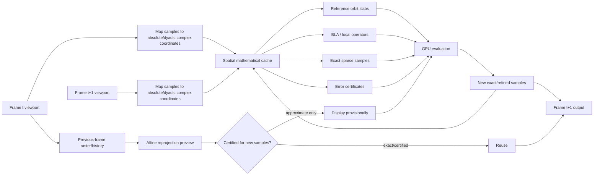

# Prior Art for a Google-Maps-Like Mandelbrot Deep-Zoom Engine

## Executive summary

This report assumes a **2–3 GB path-specific atlas**: a deliberately bounded cache/precomputed package for one intended zoom/video trajectory plus a modest envelope around that trajectory, rather than an attempt to tile the Mandelbrot set globally. For quantitative examples below I use **2.5 GiB** as the midpoint. I also assume, as requested, that network round-trip time and network bandwidth are not primary constraints; consequently, map-engine techniques motivated mainly by reducing HTTP requests matter only when they also reduce computation, memory traffic, storage, or time-to-detail.

The central conclusion is that a successful “Google Maps for the Mandelbrot set” should copy the **control architecture** of map/terrain engines but **not their content representation**.

Google Maps' regular zoom hierarchy, OGC 3D Tiles' screen-space-error traversal, Cesium's ancestor/sibling preloading, Mapbox's coarse-first prefetch, and clipmaps all transfer well as mechanisms for deciding *what region and level to work on next*. Google Maps uses a 256×256 base-tile convention and doubles linear pixel resolution at each zoom, while OGC 3D Tiles explicitly refines when projected error exceeds a screen-space threshold. citeturn19search0turn18search2 Cesium exposes this directly as `maximumScreenSpaceError` and adds ancestor/sibling preloading. citeturn18search1turn20search3

What does **not** transfer is the assumption that a coarse tile is a geometrically simplified version whose missing detail has a bounded, slowly varying error. A Mandelbrot boundary is not a band-limited surface: new filaments, islands, satellite structures and narrow gaps can appear at arbitrarily fine scales. A raster parent or finitely simplified vector boundary therefore cannot, merely by being smooth or locally homogeneous, certify the absence of unseen structure. Deep-zoom renderers instead exploit mathematical coherence: a high-precision **reference orbit** shared by nearby pixels, perturbation arithmetic for local deltas, and increasingly powerful iteration-skipping approximations such as series approximation or bivariate linear approximation (BLA). citeturn18search4turn21search3 Practical renderers such as Kalles Fraktaler and FractalShark demonstrate that these techniques are already the relevant deep-zoom computational substrate. citeturn21search1turn21search0

The highest-value architecture is therefore a **mathematical tile pyramid**. A tile should normally not mean “128×128 finished pixels.” It should mean something closer to:

> a high-precision complex-plane anchor + exact/dyadic local coordinate transform + reference-orbit chunks + BLA/series/return-map operators and validity domains + optional classification/error certificates + a small raster preview.

That is the fractal analogue of a vector tile. Mapbox Vector Tiles demonstrate the useful representation pattern: geometry is encoded in tile-local coordinates rather than carrying large global coordinates at every vertex. citeturn19search5 The same idea is substantially more valuable in a deep fractal, where the absolute coordinate may require hundreds or thousands of bits while a pixel offset within the tile may still be handled efficiently in FP32, FP64, or mantissa-plus-exponent arithmetic.

My strongest implementation recommendations are:

| Decision | Recommended starting point | Reason |
|---|---|---|
| Outer cache/render tile | **128×128 pixels** | Good compromise between metadata/dispatch overhead and fractal workload divergence; an RGBA8 preview is exactly 64 KiB. |
| GPU compute subdivision | **8×8 or 16×16 microblocks** | Lets difficult boundary regions diverge/refine without forcing an entire 128² tile down the slow path. Earlier Mandelbrot GPU work found substantial benefits from adaptive screen tiling, although its optimal 8–32-pixel values were hardware-specific. citeturn16view1turn17view0 |
| Spatial hierarchy | Quadtree with exact dyadic tile coordinates | Map-like traversal and exact parent/child/sample relationships without accumulating coordinate error. |
| Primary payload | Reference-orbit slabs + BLA/local operators + certificates | Reusable across many pixels, frames, colors and descendant views. Perturbation and BLA specifically amortize expensive high-precision work over nearby points. citeturn21search3 |
| Raster payload | Coarse/progressive preview only | Excellent latency mask; poor canonical deep representation. |
| LOD criterion | **Certified projected mathematical error**, not “iteration-count similarity” | A high-contrast fractal boundary makes an uncertified coarse representation unsafe even when it looks locally flat. |
| Interactive threshold | Start around **0.5–1 pixel** certified representation error | Engineering recommendation; tighten only regions that matter visually. |
| Final/video threshold | Start around **0.25 pixel**, with uncertain boundary pixels forced to exact/refined sampling | Engineering recommendation; substantially stricter than typical terrain SSE because fractal errors can change topology, not just geometry. |
| Prefetch | Exact-path earliest-deadline-first for video; velocity/zoom cone + ancestor fallback for free navigation | Map prefetch transfers directly, but build cost as well as load cost must enter the priority function. |
| Temporal reuse | Reuse **spatial mathematical chunks**, not primarily frame rasters | The Mandelbrot field is static; “time” is mostly a changing query footprint. |
| Deduplication | Content-addressed semantic chunks + Merkle manifests | Venti's content-hash addressing and sharing model transfers almost perfectly. citeturn16view2 |
| CDC dedup | Avoid for numerical orbit arrays | Content-defined chunking is excellent for shifted file data, but minute numerical/reference changes tend to destroy byte-level similarity in orbit streams. LBFS's Rabin-chunking technique is therefore the wrong primary boundary scheme here. citeturn23search0 |
| Highest-risk/highest-reward research | **Certified local first-return/renormalization tiles** | Renormalization can replace many ordinary iterations by one rescaled return-map evaluation; current mathematical theory provides the conceptual primitive, but there is little evidence of a production renderer using it as a certified tile codec. citeturn23search1turn23search5 |

The important conceptual shift is this:

**The atlas should cache computation, not merely imagery.**

At a 2.5 GiB midpoint budget, 64 KiB semantic chunks permit about **40,960 unique chunks** before deduplication; 32 KiB chunks permit 81,920; 4 KiB return-map/certificate objects permit 655,360. This is enough to make a path-specific atlas extremely rich if most data encode reusable mathematical work instead of full-resolution frames.

A second conclusion concerns certification. MPFR gives correctly rounded arbitrary-precision primitive operations but leaves multi-operation error propagation to the application, whereas Arb directly represents midpoint-radius balls and propagates enclosures. citeturn22search2turn22search1 That suggests a split architecture: expensive CPU-side/offline **certificate generation using ball/interval arithmetic**, followed by compact certificate consumption on the GPU. Performing arbitrary-precision intervals per output pixel on the GPU would squander much of the speedup that perturbation is intended to create.

Finally, this research found strong prior art for all the ingredients separately—map SSE, prefetching, clipmaps, local-coordinate vector tiles, GPU adaptive Mandelbrot computation, perturbation/BLA, temporal reprojection, content-addressed storage, arbitrary-precision interval arithmetic and dynamical renormalization—but **not a mature published system that combines them into a path-specific, content-addressed, certified mathematical tile atlas for deep Mandelbrot video**. That integration appears to be the most important open engineering/research opportunity.

## Architectural premise and prior-art map

A conventional web map is unusually cheap to tile conceptually because the world has a stable spatial coordinate system and every tile at zoom \(L\) has a known set of children at \(L+1\). Google Maps' tile convention maps world coordinates into a regular pyramid, with each zoom step doubling resolution in each dimension. citeturn19search0 The 1998 clipmap work generalized the same principle for textures too large to reside in physical memory: keep a finite moving window of the mip pyramid and update newly exposed borders as the viewpoint moves. The original implementation demonstrated a 170 GB virtual texture at 60 Hz, a striking early example of a small working set virtualizing a much larger multiresolution field. citeturn19search2turn19search6

For a Mandelbrot engine, define a similarly regular **logical address space**, but make it mathematical rather than image-centric.

Let an atlas root be described by a high-precision center \(C_0\) and complex-plane span \(S_0\). A tile address

\[
T=(L,x,y)
\]

denotes an exact dyadic subdivision of that root. The tile's absolute location should preferably be recoverable from \(C_0,S_0,L,x,y\), rather than storing independently rounded arbitrary-precision coordinates in every tile. Local pixel/sample coordinates then become

\[
c=C_T+s_T(\xi+i\eta),
\]

where \(C_T\) is a high-precision tile/reference anchor, \(s_T\) is a high-dynamic-range scale, and \(\xi,\eta\) are small local numbers. This is the direct conceptual analogue of Mapbox Vector Tile local coordinates: MVT stores points, lines and polygons as coordinates in a tile-local integer grid and deliberately does not embed the full geographic coordinate semantics in each geometry element. citeturn19search5

The reason to keep this hierarchy **logical rather than raster-defined** is deep-zoom perturbation. For a reference parameter \(C\) with high-precision reference orbit \(Z_n\),

\[
Z_{n+1}=Z_n^2+C,
\]

a nearby parameter \(C+c\) can be tracked using the delta \(z_n\):

\[
z_{n+1}=2Z_nz_n+z_n^2+c.
\]

Only the shared reference needs the full absolute precision; nearby pixel deltas can generally use a much cheaper numerical representation. citeturn18search4turn21search3 BLA takes this one step further by replacing ranges of perturbation iterations with local linear operators of the form

\[
z_{n+\ell}\approx A_{n,\ell}z_n+B_{n,\ell}c
\]

inside a validity radius, and BLA operators can be merged into a hierarchy with linear total storage in the reference-orbit length. citeturn21search3

That makes the appropriate hierarchy:

```text
complex-plane quadtree
        ↓
mathematical tile descriptor
        ↓
reference orbit / approximation operators / certificates
        ↓
adaptive GPU samples
        ↓
shade / color / composite
```

rather than:

```text
complex-plane quadtree
        ↓
PNG/JPEG tile
        ↓
display
```

This distinction determines almost every transfer/failure result below.

**What a 2–3 GB path atlas means.** I assume the atlas need only cover the camera path, anticipated interactive deviations from it, relevant coarser ancestors, and mathematical references whose validity domains intersect that corridor. It is therefore reasonable for thousands of frame manifests to refer to a much smaller number of immutable mathematical chunks. A “frame” need not own data at all; it can simply identify a viewport transform and a set of content hashes.

**What should not be inferred from map engines.** Mapbox's current raster endpoint defaults to 512×512 tiles largely in an ecosystem where fewer requests can have practical and commercial value. citeturn23search6 With network/request count explicitly unconstrained here, that motivation vanishes. The dominant Mandelbrot concerns are instead wasted compute in easy versus hard regions, GPU divergence, invalid approximation domains, numerical precision, and atlas reuse.

**Patent prior art.** Google's map-tile prefetch patents disclose selecting and caching tiles before use based on expected future map activity, while route-prefetch patents explicitly select sets of tiles along an anticipated route and across relevant zoom levels. citeturn20search0turn20search1 These are technically relevant to path-directed fractal prefetching, although this report is a technical prior-art analysis rather than a patentability, validity, or freedom-to-operate opinion.

## Comparative analysis by design dimension

The two matrices below explicitly cover, for each requested dimension, the relevant prior art, direct transfer versus failure modes, implementation constraints, recommended algorithms/data structures, and the principal research opportunity.

| Dimension | Strongest prior art / primary or official source | What transfers from maps | What fails or needs replacement for Mandelbrot |
|---|---|---|---|
| **Screen-space error thresholds** | OGC 3D Tiles defines SSE as pixel-space error of a simplified representation and refines when it exceeds the allowed error; Cesium exposes `maximumScreenSpaceError`, historically defaulting to 16 px. citeturn18search2turn18search1 | Drive traversal from *projected error*, not fixed zoom alone. Parent may remain visible until child satisfies target quality. | A single geometric-error scalar derived from spatial simplification is insufficient. Fractal topology can change inside an apparently uniform tile, and “16 pixels of error” can mean losing entire filaments/components. |
| **Subpixel / progressive refinement** | Donner & Jensen tiled sparse multipass GPU computations and demonstrated the method on a Mandelbrot shader; they remove inactive tiles and recursively focus work. citeturn16view1turn17view0 Mapbox coarse-first prefetch similarly prioritizes a fast lower-resolution result. citeturn20search2 | Render an immediately available approximation, then repair only uncertain regions. Maintain active tile/microtile queues rather than repeatedly executing finished pixels. | Border equality or smooth-looking parent pixels is not evidence that subpixel fractal structure is absent. Ordinary interpolation can invent or erase boundary structure. |
| **Mathematical / vector tiles** | Mapbox Vector Tile specification: Protobuf tile payloads with geometry encoded in a local tile grid. citeturn19search1turn19search5 Deep-fractal analogue: perturbation/BLA. citeturn21search3 | Tile-local coordinates, decoupled styling, hierarchical addressing, compact declarative payloads. | Finite vectorization of the Mandelbrot boundary is not a stable canonical representation at unlimited zoom. “Simplify line geometry to tolerance ε” does not establish the absence of smaller components or filaments. |
| **Prefetch before detail is visible** | Google's activity-based map-tile prefetch and route-prefetch disclosures; Cesium's ancestor/sibling preloading; Mapbox's lower-zoom-first `prefetchZoomDelta`. citeturn20search0turn20search1turn20search3turn20search2 | Predict future footprints; preload fallback ancestors, lateral neighbors and future path tiles. | A fractal tile can require substantial *computation* before it can be uploaded. Priority by spatial distance alone ignores reference-orbit generation, BLA construction and precision escalation cost. |
| **Space-time tile reuse** | Clipmaps reuse spatial data under moving viewpoints. citeturn19search6 Reverse reprojection caching reuses expensive shading calculations between adjacent frames through temporal coherence. citeturn19search3 | Preserve data shared by overlapping consecutive viewports; only repair newly exposed/invalid regions. | Reprojected image values are unsafe across a fractal boundary. Continuous zoom also changes the sample lattice, so nearby old pixels are not necessarily samples at the required new complex parameters. |
| **Content-addressed deduplication** | Venti uses a content hash as block identifier and coalesces duplicate blocks; unchanged snapshots share blocks. citeturn16view2 LBFS uses Rabin fingerprints for content-defined chunk boundaries. citeturn23search0 | Immutable chunks, hash identity, Merkle-style manifests, automatic sharing across frames/levels/atlases. | Blind content-defined chunking of orbit arrays is poorly matched to high-precision numerical data: changing a reference or precision can change essentially every downstream floating representation. |
| **Compact local-coordinate / return-map payloads** | MVT local coordinates provide the storage pattern. citeturn19search5 BLA supplies practical local iteration operators. citeturn21search3 Complex-dynamics renormalization formalizes a rescaled first-return map in which one renormalized step can represent a long finite orbit. citeturn23search1turn23search5 | Anchor + local delta + reusable operator is a direct and powerful transfer. | Return maps are not uniformly benign: near-neutral/parabolic regimes and changing return times can shrink validity domains or require multiple branches. A fixed low-order jet cannot be assumed valid without a remainder certificate. |
| **GPU-friendly tile sizes/layouts** | Google commonly uses 256² logical tiles; Mapbox supports 256² and 512² raster tiles. citeturn19search0turn23search6 Direct3D tiled resources decouple logical sparse resources from physical memory. citeturn18search3 Donner & Jensen show the importance of smaller adaptive computational tiles for Mandelbrot-like sparse iteration. citeturn16view1 | Regular tiles, Morton/locality ordering, sparse residency, parent fallback. | A map's large raster tile is homogeneous work; a Mandelbrot tile may contain pixels escaping after 10 iterations next to pixels requiring millions. Large compute tiles amplify SIMT divergence and overcomputation. |
| **Error-certified LOD** | Hart, Sandin & Kauffman use distance estimates to skip empty space around fractal sets, including lower-bound concepts. citeturn22search0 Arb provides arbitrary-precision ball arithmetic; MPFR provides correctly rounded primitives; IEEE 1788 standardizes interval arithmetic concepts. citeturn22search1turn22search2turn22search3 | Replace “detail level” by a provable error envelope projected into screen space. | Ordinary distance-estimation formulas, iteration counts, BLA heuristics and FP rounding are not automatically certificates. Hart et al. themselves discuss failure/overestimation issues for approximate distance estimates. citeturn22search0 |

The implementation choices and gaps are more explicit here:

| Dimension | Main implementation constraints | Adopt | Avoid | Highest-value open gap |
|---|---|---|---|---|
| Screen-space error | Need error represented in complex-plane units and converted at arbitrary zoom; error may differ radically within one tile. | Per-tile certificate + microtile error maxima; refine only while projected uncertainty exceeds threshold. | Fixed level solely from camera zoom; copied Cesium-style 16 px threshold. | A fractal-specific SSE combining classification, coordinate and shading error in a single cheap conservative bound. |
| Progressive refinement | GPU occupancy, active-list compaction, subpixel sample storage, temporal stability. | Coarse parent → sparse samples → uncertain microblocks → final supersampling. | “All sampled pixels equal, therefore fill rectangle” without certification. | Sampling schedules whose points are exactly reusable across continuous deep zooms. |
| Mathematical tiles | Reference-orbit size, approximation validity, high-precision anchors, formula/version compatibility. | Tile-local deltas; shared orbit slabs; BLA tree; independent palette/shading. | Prebaking every colorized frame. | Standard compact “fractal vector tile” schema with deterministic semantics. |
| Prefetch | Build time may dwarf I/O; high-period references can be expensive; precision requirement grows down-path. | Deadline/slack scheduling incorporating expected CPU/GPU build cost. | Pure nearest-tile FIFO. | Predictor that estimates *mathematical preparation cost* and probability of reuse jointly. |
| Space-time reuse | Camera sample grids change; old pixels can straddle new boundaries; history invalidation. | Reuse content hashes and exact coordinate samples; use raster reprojection only as a provisional preview. | Treating temporally nearby image pixels as mathematically interchangeable. | Exact sparse sample reuse across arbitrary affine zoom trajectories. |
| Content addressing | Deterministic serialization, hash/index overhead, numerical-format versions. | Hash semantic chunks; frame manifests contain hashes; canonical byte representation. | Hashing giant monolithic per-frame files; CDC for primary orbit segmentation. | Cross-reference canonicalization so mathematically equivalent operators hash identically despite alternative construction histories. |
| Local/return maps | Radius of convergence/validity, near-parabolic dynamics, branch selection, numerical conditioning. | BLA immediately; experimental certified Taylor/return-map jets in favorable regions. | Uncertified aggressive period skipping. | Certified renormalization codec that stores thousands/millions of iterations in kilobytes. |
| GPU layout | Divergence, random accesses into reference data, cache pressure, memory bandwidth. | 128² outer tiles + 8²/16² compute microtiles; SoA state; compact active lists. | 512² monolithic compute dispatch. | Operator encoding optimized for warp-coherent BLA/return-map evaluation. |
| Certified LOD | Interval dependency/wrapping, cost of arbitrary precision, hard interior proofs near boundary. | CPU/offline ball arithmetic to produce compact GPU-consumable certificates. | Per-pixel arbitrary-precision interval arithmetic as normal render path. | Hierarchical certificates whose proof composes under quadtree refinement and BLA merging. |

**Screen-space error in more detail.** OGC's model works because a tile has a world-space `geometricError`, and the renderer projects that quantity to pixels using camera geometry. citeturn18search2 A Mandelbrot implementation should preserve that architecture but redefine the primitive error.

Let \(\sigma_f\) be the complex-plane width represented by one screen pixel in frame \(f\), and let a tile/operator have a certified complex-domain uncertainty or remainder \(\epsilon_T\). A basic projected error is

\[
E_\text{px}(T,f)=\frac{\epsilon_T}{\sigma_f}.
\]

This is useful for local-coordinate and operator approximation error, but classification needs a stronger condition: if an unresolved boundary could lie anywhere inside the tile, its error must be treated as unbounded rather than as the tile's average interpolation error.

A practical policy is therefore a **three-state tile certificate**:

`CERTIFIED_UNIFORM`, `CERTIFIED_APPROXIMATE`, or `UNRESOLVED_BOUNDARY`.

For `CERTIFIED_UNIFORM`, no further sampling is necessary at the requested output semantics. For `CERTIFIED_APPROXIMATE`, compare its mathematical remainder projected to screen space with the LOD threshold. `UNRESOLVED_BOUNDARY` always subdivides or supersamples until either a certificate is established or the final sampling budget is reached.

The proposed **0.5–1 px interactive and ≈0.25 px final/video thresholds** are engineering starting points, not values established in prior literature. They are intentionally much tighter than Cesium's common terrain default because a terrain simplification error generally moves geometry, whereas an error in fractal classification can create/delete a visible topological feature. Cesium's documented default of 16 is therefore evidence for the *mechanism*, not a sensible Mandelbrot constant. citeturn18search1

**Subpixel refinement.** Donner and Jensen's GPU work is especially relevant because it explicitly included a Mandelbrot solver: divide the screen into tiles, keep an active queue, eliminate tiles whose computation is finished and adaptively isolate remaining work. Their historical implementation reported strong speedups and found optimal fixed tiles around 8–32 pixels on its contemporary hardware, with smaller tiles eventually losing to overhead. citeturn16view1turn17view0 Those numeric optima should not be transplanted to a modern GPU, but the two-scale architectural lesson remains sound: **large storage tiles, small scheduling microtiles**.

The progressive sampling order I would adopt is:

`parent preview → center/corners or structured sparse phase → 2×2 subpixel phase → certified easy blocks terminate → compact unresolved blocks → additional phases / exact render`.

Use a persistent bit mask per 8×8 or 16×16 microblock describing which subpixel phases are resolved. For video, rotate or stratify phases temporally only when the samples' exact complex coordinates are retained; otherwise temporal accumulation risks treating an interpolated prior sample as exact.

**Mathematical tiles.** The analogy to MVT should stop at local coordinates and modular payloads. citeturn19search5 Do **not** encode a polygonal approximation of the Mandelbrot boundary as the canonical layer. Instead, define a mathematical tile as an executable/certifiable representation of the function in that region:

```text
TileHeader
  tile_level, tile_x, tile_y
  anchor_hash
  formula_hash
  numeric_format
  precision_contract
  operator_version

References[]
  orbit_slab_hashes
  reference_anchor
  iteration ranges

Operators[]
  BLA nodes / series coefficients
  validity radii
  error bounds

Certificates[]
  exterior/interior/uniform blocks
  operator remainder bounds

Preview
  optional scalar or raster fallback

Children[]
  content hashes or absent markers
```

BLA is particularly suitable because its operator/radius tree already looks like a mathematical LOD payload: mathr's derivation explicitly constructs merged BLA steps and a lookup choosing the largest valid skip. citeturn21search3

## Tile, payload, and GPU design

A useful distinction is between **logical tiles**, **storage chunks**, and **GPU workgroups**. They should not be forced to have the same size.

A logical tile is an addressable region of the complex plane. A storage chunk is a deduplication/compression unit. A workgroup or microtile is a scheduling unit. Conflating all three is convenient in a simple map engine but costly for the highly nonuniform Mandelbrot workload.

The following estimates use a **3840×2160 output** solely as a normalization point, with an RGBA8 preview and a one-tile spatial halo. They do not introduce a requirement that the engine render only 4K.

### Candidate outer tile sizes

| Outer tile | Visible tiles at 3840×2160 | Tiles with one-tile halo | Raw RGBA8 / tile | RGBA8 working set with halo | Halo overhead | Mandelbrot assessment |
|---|---:|---:|---:|---:|---:|---|
| **64×64** | 2,040 | 2,232 | 16 KiB | 34.9 MiB | 9.4% | Fine-grained and low overfetch, but thousands of descriptors/dispatch units per frame. Best as a compute subdivision rather than atlas tile. |
| **128×128** | 510 | 608 | 64 KiB | **38.0 MiB** | 19.2% | **Best default.** Manageable traversal count, small enough to isolate difficult fractal regions, convenient 64 KiB raster payload. |
| **256×256** | 135 | 187 | 256 KiB | 46.8 MiB | 38.5% | Good map-style administrative tile; somewhat too coarse as the lowest compute-scheduling level. Google's conventional tile size is 256². citeturn19search0 |
| **512×512** | 40 | 70 | 1 MiB | 70.0 MiB | 75.0% | Good when reducing map requests matters; poor default here because a single difficult filament can make a large tile expensive and halo overfetch becomes severe. Mapbox's 512² default reflects different tradeoffs. citeturn23search6 |

The table exposes why the map world's “larger tiles mean fewer requests” argument should not dominate this design. At 512², merely maintaining a one-tile halo around a 4K viewport increases raw RGBA8 residency to 70 MiB. At 128² the same policy costs 38 MiB and gives four times finer linear scheduling granularity.

Microsoft's tiled-resource model is nevertheless conceptually valuable: logical sparse resources are decoupled from backing memory, so only needed regions need physical residency. citeturn18search3 A Mandelbrot renderer should exploit the equivalent API available on its target graphics backend for preview/scalar layers, while keeping mathematical chunk residency independently managed.

**Recommended hierarchy:** use **128×128 as the outer render/cache tile**, but process it as 8×8 or 16×16 microblocks. A 128² tile thus contains 256 8² microblocks or 64 16² microblocks. The GPU queue contains only unresolved microblocks. The outer tile remains the unit for quadtree traversal, CAS manifests and coarse preview.

A structure-of-arrays layout is preferable for active iterative state:

```text
delta_z_re[]
delta_z_im[]
iteration[]
reference_index[]
scale_exponent[]
status_flags[]
derivative_or_DE_state[]
```

rather than an array of large per-pixel structs. This facilitates coalesced accesses when many lanes use the same phase of the perturbation loop. Once lanes diverge heavily in iteration count or BLA validity, compact surviving lane/microblock IDs into a new queue rather than continuing to execute dead lanes.

Kalles Fraktaler's published implementation documentation gives a sense of why state layout matters: it has historically budgeted up to roughly 50 bytes per pixel and around 40 bytes per reference iteration depending on mode. citeturn21search5 FractalShark likewise devotes substantial engineering to compact numerical forms and reference-orbit compression, including a custom mantissa-plus-exponent representation and runtime decompression; its author reports multi-gigabyte savings on extremely high-period references in favorable cases. citeturn21search0turn21search4 The specific numbers are renderer-dependent, but the general lesson is clear: **reference data can dominate memory before the output framebuffer does**.

At 4K60, merely writing a full image once per frame costs approximately:

| Per-pixel write payload | Pure sequential write traffic at 4K60 |
|---|---:|
| 4 B/pixel | 1.99 GB/s |
| 8 B/pixel | 3.98 GB/s |
| 16 B/pixel | 7.96 GB/s |

These are arithmetic lower bounds, not measured GPU costs: they omit reads, caches, reference orbit traffic, active-list passes, overdraw and intermediate buffers. They show why avoiding unnecessary full-screen intermediate passes is worthwhile even on a high-bandwidth GPU.

### Candidate payload formats

The costs below are **design estimates**, not file sizes reported by prior engines. The purpose is to compare representation classes under the 2–3 GB assumption.

| Payload | Example size | Recolorable? | Reusable across deeper views? | GPU cost | Strength | Weakness |
|---|---:|---|---|---|---|---|
| RGBA8 preview, 128² | **64 KiB** | No | Only as transient parent preview | Minimal | Immediate display; maps trivially to texture cache | Color-locked; contains no mathematical knowledge; interpolating near boundary is unsafe |
| R16 scalar field, 128² | **32 KiB** | Yes | Limited | Very low | Twice the tile density of RGBA8; palette independent | One scalar generally cannot encode classification, DE and uncertainty simultaneously |
| Two 16-bit scalar channels, 128² | **64 KiB** | Yes | Limited | Low | Smooth potential + auxiliary confidence/DE channel | Half precision may be insufficient for some derived quantities |
| Two 32-bit scalar channels, 128² | **128 KiB** | Yes | Limited | Moderate | Robust render/shading intermediates | Expensive atlas representation if used everywhere |
| Reference-orbit slab, 4,096 complex FP64 values | **64 KiB raw** | Yes | **High** | Excellent when shared coherently | Direct substrate for perturbation | Precision/exponent metadata or compressed formats may change size; long-period references require many slabs |
| Proposed reference slab with ≈24 B/sample packed state | **96 KiB** | Yes | **High** | Moderate | Can include exponent/derivative/flags | Design-dependent; random access can hurt cache |
| Proposed BLA/operator block, ~1,024 nodes | **≈48–64 KiB** | Yes | **Very high** inside validity domain | High leverage | Skips many ordinary perturbation steps; BLA is established deep-zoom practice. citeturn21search3 | Validity radius can collapse in difficult dynamics |
| Sparse exact/certified sample block, 4,096 × 16 B | **64 KiB** | Usually | High if sample coordinates recur | Low | Useful temporal/path cache | Continuous zoom seldom maps every new pixel center to an old point |
| Proposed local return-map jet + certificate | **~1–4 KiB typical target** | Yes | Potentially **extreme** | Potentially excellent | Could represent very long orbit segments compactly | Research payload; certification and branching are the hard part |
| Tile manifest / Merkle node | ~0.25–4 KiB | N/A | Extreme | Negligible | Shares all immutable chunks | Requires strict canonical serialization |

At the 2.5 GiB midpoint, an atlas filled exclusively by fixed-size chunks would hold roughly:

| Chunk size | Chunks in 2.5 GiB |
|---:|---:|
| 4 KiB | 655,360 |
| 16 KiB | 163,840 |
| 32 KiB | 81,920 |
| 64 KiB | **40,960** |
| 96 KiB | ~27,306 |
| 128 KiB | 20,480 |
| 256 KiB | 10,240 |

Content-addressed sharing means frame count need not be remotely proportional to these numbers. Venti's core observation is directly applicable: when an immutable block's identity is its content hash, multiple logical snapshots can point at one physical copy, and duplicate writes coalesce automatically. citeturn16view2

I would tentatively allocate the 2–3 GB atlas approximately as follows, with percentages treated as tuning targets rather than fixed requirements: **55–70% reference/operator mathematical payloads, 10–20% certificates and sparse samples, 10–20% coarse raster/scalar fallbacks, and the remainder for manifests, indices and hash tables**. This biases storage toward expensive work that survives recoloring and multiple camera frames.

**Content-addressing design.** Do not hash a whole “tile package.” Hash semantic pieces:

```text
OrbitSlab
  formula/version
  canonical reference anchor
  precision
  iteration_start
  iteration_count
  canonical encoded orbit values

BLAChunk
  input orbit slab hashes
  construction parameters
  operators
  validity/error bounds

ReturnMapChunk
  anchor / scale / branch identifier
  period or return-time description
  coefficients
  certified remainder/domain

CertificateChunk
  spatial dyadic region
  claim type
  bound
  proof/operator dependencies

PreviewChunk
  source semantic hashes
  render semantics
  pixel payload

TileManifest
  logical tile key
  hashes of any/all above
```

The content hash should cover a **canonical byte representation**, including endianness, precision, formula version, rounding contract and encoding version. Normalize representations such as signed zero where semantics permit it; never allow compiler-dependent struct padding or non-deterministic serialization to enter a persistent hash.

LBFS's content-defined chunking is a weaker match. It deliberately uses Rabin fingerprints so that inserting bytes changes only nearby chunk boundaries; its original design used an expected 8 KiB chunk size with bounds to avoid pathological chunks. citeturn23search0 Orbit arrays have a different failure mode: changing a reference parameter or its precision may alter the actual floating values throughout later iterations, so there may be no long byte-identical shifted substring for CDC to rediscover. I would therefore use **semantic iteration ranges**—for example fixed 2K/4K/8K orbit slabs—rather than rolling-hash boundaries. CDC could still be useful on generic metadata bundles, but it should not define the mathematical storage model.

## Prefetch and space-time reuse

Map prefetch has three relevant strands. Google's disclosed systems preload tiles inferred from future activity or positions, including explicit route-oriented sets. citeturn20search0turn20search1 Cesium can preload ancestors to make zoom-out/newly exposed areas better populated and siblings to improve panning at the cost of more loads. citeturn20search3 Mapbox supports deliberately fetching a coarser zoom before the requested zoom so the complete view can appear earlier. citeturn20search2

All three ideas transfer, but for a Mandelbrot renderer the scheduler should prefetch **computation dependencies**, not simply final tiles.

For a known video path, each mathematical tile/chunk has a readily derived **first-use deadline**:

\[
d_i = \text{first frame at which chunk }i\text{ is required to satisfy target SSE}.
\]

It also has an estimated remaining preparation cost \(p_i\), including high-precision orbit construction, operator construction/certification, decompression and GPU upload. Scheduling by pure deadline is workable; scheduling by **least slack**

\[
s_i=d_i-t-p_i
\]

is better because an expensive reference required ten seconds from now can be more urgent than an already-built preview needed two seconds from now.

For free navigation, estimate a probability \(q_i\) from pan velocity, zoom velocity, acceleration and pointer/input trajectory. A practical priority is then conceptually

\[
P_i \propto \frac{q_i\,V_i}{\max(s_i,\epsilon)},
\]

where \(V_i\) is the expected value of the chunk: number of future pixels/frames accelerated, multiplied by the cost it saves. The exact formula should be learned from traces rather than treated as universal.

The prefetch pipeline should look like this:

```mermaid
flowchart LR
    A[Camera state or known video path] --> B[Predict future view footprints]
    B --> C[Intersect footprints with quadtree]
    C --> D[Derive required screen-space error by frame]
    D --> E[Resolve math dependencies]
    E --> F{Content hash already in atlas/cache?}

    F -- yes --> G[Raise residency priority]
    F -- no --> H[Estimate reference/operator build cost]

    H --> I[Deadline / slack priority queue]
    I --> J[High-precision reference build]
    J --> K[BLA / series / return-map build]
    K --> L[Certificate generation]
    L --> M[Content-addressed store]

    M --> N[GPU staging and residency]
    G --> N
    N --> O[Render requested detail]

    O --> P{Detail ready by deadline?}
    P -- yes --> Q[Use target LOD]
    P -- no --> R[Use parent / coarse preview]
    R --> O
```



The important departure from maps is the `Resolve math dependencies` stage. A future 128² image tile may depend on an orbit slab shared with twenty other tiles. Prefetching that slab once can therefore have much higher utility than rendering one future tile.

### Prefetch strategies and estimated costs

These examples use 128² RGBA8 fallback tiles and 3840×2160 purely to make the memory implications concrete.

| Strategy | Resource estimate | Pros | Cons | Recommendation |
|---|---:|---|---|---|
| **Visible only** | 510 tiles ≈ **31.9 MiB** | Minimum preview residency | Any pan exposes holes; no fallback preparation | Avoid except severe memory pressure |
| **One outer-tile halo** | 608 total ≈ **38.0 MiB**, only ~6.1 MiB beyond visible | Excellent cheap lateral safety zone | Does not anticipate fast directional motion | **Always enable** |
| **One coarser ancestor layer** | About 135 128² tiles ≈ **8.4 MiB** additional for the normalized viewport | Very cheap complete-view fallback; analogous to map coarse-first strategies. citeturn20search2 | Parent may visually omit fractal features; only a transient representation | **Always keep or regenerate cheaply** |
| **Two ancestor layers** | Roughly another ~2.5 MiB beyond the first in this normalized view | Robust fast zoom-out | Diminishing value | Good default |
| **All siblings of selected children** | Worst-case prefetch can add up to three children per selected child before parent-group dedup; contiguous viewports are much cheaper | Good arbitrary panning, as Cesium documents. citeturn20search3 | Wasteful at deep levels where each child is expensive | Enable only within a short probability horizon |
| **Velocity cone / half-viewport lead** | A 50% extra raster area would be ≈16 MiB at this normalization | Strong free-navigation prediction | Wrong-direction input wastes work | **Recommended interactive policy** |
| **Known-path exact footprint** | Only chunks whose future footprint intersects path corridor | Nearly perfect hit rate for fixed video | Brittle to unscripted deviations | **Best video policy** |
| **Known-path math lookahead** | Example: 20 new 64 KiB math chunks/frame × 120 frames = **150 MiB** for a 2 s, 60 fps lookahead | Moves expensive work far ahead of visible detail | Requires dependency/cost model | **High priority** |
| **Whole path atlas resident** | Up to 2–3 GB by assumption | Eliminates storage misses | May exceed desirable VRAM even though host storage is acceptable | Keep atlas host-resident; selectively GPU-resident |

Since network latency is explicitly not constrained, **ancestor and preview data are valuable because they hide compute/certification latency**, not because they reduce HTTP wait time.

### Space-time reuse

Temporal rendering prior art is also instructive. Reverse reprojection caching stores expensive calculations associated with visible surface points and tries to recover them in subsequent frames using reprojection and a validity test. citeturn19search3 That logic transfers partially, but the Mandelbrot parameter plane has an important advantage and disadvantage.

The advantage is that the mathematical field is static: \(f(c)\) does not animate when the camera moves. The disadvantage is that a new frame evaluates it at a *new sampling lattice*. Resampling old colors is therefore not mathematically equivalent to evaluating the field at new pixel centers, especially around the boundary.

Consequently, there should be three temporal reuse classes:

**Exact reuse.** The new sample has the same exact dyadic/local complex coordinate as an old sample. Reuse classification, smooth value, derivative and certificate verbatim.

**Operator reuse.** The sample is new, but lies in an already-cached reference/BLA/return-map validity domain. This is more valuable than exact pixel reuse because one operator may accelerate thousands of novel samples.

**Approximate visual reuse.** Reproject/interpolate a prior raster only to produce an instantaneous provisional image. Never let it satisfy final error certification near an unresolved boundary.

A suitable architecture is:



A key storage consequence follows: **do not create a separate content package for every time step**. A video frame manifest should contain camera state plus references to spatial/math hashes. Thousands of frames can share one orbit slab, one BLA tree and one certificate block exactly as many Venti snapshots can share unchanged blocks. citeturn16view2

There is a particularly promising path-specific optimization that does not appear prominently in map engines: construct the union of all future view footprints in **space × scale**, then solve a set-cover-like problem over candidate references. Instead of choosing one reference orbit independently for every tile, choose reference centers whose perturbation/BLA validity regions cover the largest amount of anticipated path demand per byte and per precompute second. That turns reference placement into an offline atlas optimization problem.

## Error certification and numerical robustness

This is the dimension where ordinary map LOD transfers least directly and where the strongest technical differentiation is possible.

A terrain tile can state “my geometric approximation differs from the source by at most \(e\) meters,” after which a camera projection converts \(e\) to an SSE. OGC 3D Tiles is explicitly structured around this relationship. citeturn18search2 A fractal tile needs an analogous **proof object** but has several different error modes:

1. error in the absolute complex coordinate;
2. floating-point error in the reference orbit;
3. perturbation error and glitches;
4. BLA/series truncation error;
5. uncertainty in whether a pixel footprint intersects the set;
6. error in smooth potential/distance/color quantities even when escape classification is known.

Perturbation is exact algebraically before floating-point error: the nearby orbit is represented by a delta around a high-precision reference. But low-precision perturbation can still develop “glitches” when the reference becomes poorly conditioned for the nearby point, which is why mature implementations employ rebasing, additional references or related remedies. citeturn18search0turn21search3 BLA likewise has an explicit validity radius; using an operator beyond that radius would invalidate its approximation assumptions. citeturn21search3

That suggests making **validity domains first-class atlas data**, not renderer-internal heuristics.

A BLA node should conceptually contain:

```text
iteration range
A, B operator coefficients
validity radius / domain
rounding + truncation remainder bound
dependencies
numeric format
```

The GPU should not ask simply “is a BLA available?” It should ask “does this pixel's current delta ball fit inside the certified input domain?”

### Certification hierarchy

A realistic engine should use multiple proof strengths rather than trying to run the heaviest rigorous method everywhere.

**Level A — heuristic preview.** Normal FP perturbation/BLA, raster parent, temporal reprojection. Fast and visibly useful, but incapable of terminating final LOD by itself.

**Level B — numerically bounded operator.** Reference and local operator carry explicit accumulated numerical/truncation error bounds. The renderer can prove that the resulting scalar/color error projects below the current threshold, but may not prove topological membership for an entire pixel footprint.

**Level C — classification certificate.** A ball/interval computation encloses every orbit for a parameter cell or sample footprint sufficiently tightly to prove escape, or a rigorous interior mechanism proves trapping/attraction. The tile can terminate without additional sampling where the requested render semantics are compatible with the certificate.

**Level D — final boundary sampling.** Cells for which interval dependency or chaotic sensitivity prevents a useful enclosure are subdivided until individual sample points can be computed at sufficient precision. Certification then governs the numerical result rather than attempting to prove a large cell homogeneous.

Arb is unusually well aligned with offline Levels B/C because it represents real and complex quantities as midpoint-radius enclosures and automatically propagates numerical bounds. citeturn22search1turn17view2 MPFR provides a complementary primitive: arbitrary-precision operations with defined, correct rounding, but its authors explicitly note that composed error bounds are the application's responsibility. citeturn22search2turn22search6 IEEE 1788 formalizes interval arithmetic semantics more generally. citeturn22search3turn22search7

The strongest practical design is therefore **asymmetric**:

> generate proofs with expensive arbitrary-precision interval/ball arithmetic offline or on CPU workers; render with cheap FP32/FP64/mantissa-exponent arithmetic on the GPU; store only the compact proof bounds needed to know when the cheap result is valid.

Trying to make every GPU perturbation operation an arbitrary-precision interval operation would destroy much of the performance advantage.

### Distance estimates: useful, but distinguish heuristic from proof

Fractal distance estimation is old prior art. Hart, Sandin and Kauffman used distance bounds/estimates to make large safe steps while ray tracing deterministic fractals instead of sampling every point uniformly. citeturn22search0turn22search8 This is a strong conceptual precedent for Mandelbrot LOD: if a sample can be shown safely farther from the boundary than the radius of its pixel footprint, there is no reason to spend subpixel samples there.

But the same paper discusses inaccuracies in approximate distance estimates and precautions against excessively large steps. citeturn22search0 Therefore:

**Adopt:** a rigorously enclosed distance lower bound as a termination certificate.

**Adopt as heuristic:** ordinary derivative-based Mandelbrot DE for deciding which pixels/microblocks to refine first.

**Avoid:** treating an ordinary floating-point DE value as a formal proof that the whole pixel footprint misses the boundary.

For a pixel with complex-plane footprint radius \(r_p\), the ideal exterior rule is conceptually:

\[
d_{\min}(c,\mathcal M) > r_p + \epsilon_{\text{numeric}}
\quad\Rightarrow\quad
\text{pixel footprint cannot intersect }\mathcal M.
\]

The difficult part is obtaining a truly conservative \(d_{\min}\), which is precisely where interval/ball evaluation and certified derivative bounds become useful.

### Why tile-level interval iteration alone is not enough

A naive rigorous method would represent an entire parameter tile by a complex interval \(C\) and iterate

\[
Z_{n+1}=Z_n^2+C
\]

with interval arithmetic. If the lower magnitude bound eventually exceeds the escape radius, escape is certified for the entire region.

Unfortunately, interval dependency and wrapping can cause the enclosure to blow up long before the actual family of orbits does. This is a standard limitation of interval composition rather than a defect in Arb. Arb's paper itself discusses interval width and strategies for controlling rigorous numerical evaluation. citeturn22search1 Near the Mandelbrot boundary, therefore, the hierarchy should switch from a big tile interval to:

`tile → microtile → Taylor/BLA enclosure → smaller cell → point samples`

rather than carrying one ever-expanding interval.

This is where BLA and certification could be combined more deeply. BLA already summarizes a range of iterations by \(A,B\) plus a validity radius. citeturn21search3 A **certified BLA** would attach an outward-rounded nonlinear remainder. Merging nodes would merge both the operator and its error ball. Such a structure could serve simultaneously as an iteration accelerator and a mathematical LOD certificate.

### Numerical-format constraints

Deep zoom creates two distinct precision problems that should not be conflated.

The **absolute-coordinate problem** requires enough bits to specify \(c\) at the current scale. This belongs on the CPU/atlas anchor side.

The **local-dynamics problem** asks whether the perturbation delta, BLA coefficients and evolving orbit difference fit into a fast GPU numerical representation. This is why local coordinates and mantissa-plus-exponent formats are so powerful. FractalShark explicitly experiments with a two-32-bit-component plus exponent representation intended to provide more effective mantissa than one FP32 value without taking the full cost of native FP64 on consumer GPUs. citeturn21search0 Kalles Fraktaler likewise includes rescaled perturbation schemes intended for arbitrarily deep magnifications. citeturn21search1

The atlas should therefore carry a **precision contract** per operator, for example:

```text
input |δc| range
required mantissa bits
exponent range
reference precision
maximum accumulated operator remainder
fallback operator / reference
```

A GPU kernel can then select FP32, FP64, extended-exponent, or CPU/high-precision fallback without discovering precision failure after doing most of the work.

## Research gaps and recommended architecture

The prior art strongly suggests that incremental gains from “better PNG tiling” are no longer the interesting part of the problem. The high-impact unexplored space lies in treating complex dynamics itself as a compressible, certifiable scene representation.

**The most important research opportunity is a certified return-map tile codec.** Complex-dynamics renormalization represents a rescaled first-return map to a small neighborhood, and recent theoretical exposition explicitly emphasizes that one renormalized iterate can control a long finite orbit of the original quadratic map. citeturn23search1turn23search5 BLA is already a practical, much simpler version of the same broad idea: replace many low-level iterations by a compact local operator when the neglected nonlinear contribution is sufficiently small. citeturn21search3

A next-generation tile might store

\[
R(w,\tau)
   =a_0+a_1w+a_2w^2+\cdots
     +b_1\tau+b_2w\tau+\cdots
     +\mathcal E,
\]

where \(w\) is a normalized local dynamical coordinate, \(\tau\) a normalized parameter offset, and \(\mathcal E\) a **rigorously bounded remainder** over a certified domain. Metadata would identify a return period/branch and rescaling. One evaluation could then replace hundreds, thousands or potentially far more ordinary iterations.

The obstacles are substantial: return time may differ across neighboring points; near-neutral or parabolic dynamics can be poorly conditioned; the useful domain may become very small; and a low-degree polynomial can cease to approximate the return map sufficiently well. The renormalization literature itself distinguishes regimes where uniform control is difficult. citeturn23search1turn23search5 But this is exactly why the representation should include a certificate and fall back to BLA/perturbation when it fails. The best research target is **not a universal return map**, but a library of opportunistic certified operators whose failure is safe.

**A second high-impact gap is path-aware reference placement.** Existing perturbation renderers generally need one or more reference orbits for an image/location; practical engines invest heavily in reference generation and compression. citeturn21search0turn21search1 A path atlas creates a different optimization problem because the entire future camera trajectory is known or statistically predictable.

Define every candidate reference \(r\) by:

- its storage cost;
- build cost;
- validity region at each relevant iteration range;
- estimated number of path samples it accelerates;
- overlap with other references.

Then select references to maximize something like

\[
\frac{\text{future iteration work avoided}}
     {\alpha\,\text{atlas bytes}+\beta\,\text{precompute seconds}}.
\]

This is effectively weighted set cover/facility location in scale-space. A strategically placed reference might serve many adjacent frames and descendant tiles, greatly outperforming “one reference per image.”

**A third gap is exact space-time sample reuse.** Reverse reprojection has shown the value of temporal caches in ordinary real-time graphics. citeturn19search3 But an arbitrary zoom trajectory rarely causes new pixel centers to coincide exactly with old ones. A fractal renderer could design its sampling lattice intentionally to create coincidences: store samples on a global dyadic lattice, choose subpixel phases from nested low-discrepancy/dyadic sets, and have output pixels query/reconstruct from those samples only when a mathematical error certificate permits it. This changes the problem from “can I reproject the previous image?” to “can I choose camera sampling so that today's expensive samples remain mathematically useful tomorrow?”

**A fourth gap is proof-carrying LOD.** Existing map tiles carry a geometric-error scalar. citeturn18search2 Existing numerical libraries can carry rigorous arithmetic error. citeturn22search1turn22search2 Existing deep-zoom operators carry validity criteria. citeturn21search3 Bringing these together suggests a tile format in which every approximation can carry a compact proof contract:

```text
domain:
    exact dyadic complex region
operator:
    hash of mathematical payload
guarantee:
    classification | potential | distance | orbit-state
error_bound:
    complex / scalar interval
valid_through_iteration:
    N
dependencies:
    hashes
```

The renderer could then perform a Cesium-like traversal where the “geometric error” is the projection of an actual numerical proof. No source located in this research describes that full architecture for Mandelbrot rendering.

**A fifth opportunity is semantic, rather than byte-level, deduplication.** Venti proves the utility of content hashes when bytes are identical. citeturn16view2 A more advanced fractal CAS could canonicalize operators mathematically. Two tiles constructed independently might derive equivalent BLA coefficients, reference segments, or return maps but serialize differently because of precision, anchor choice or construction sequence. A canonical normalized local-coordinate representation could turn some of those near-duplicates into actual duplicates. This is considerably harder than generic CAS but especially valuable in nested/self-similar paths.

### Recommended end-to-end architecture

The architecture I would implement first is:

```text
                           PATH / CAMERA
                                │
                                ▼
                   future footprint planner
                                │
                    ┌───────────┴───────────┐
                    ▼                       ▼
              quadtree traversal      deadline scheduler
                    │                       │
                    └───────────┬───────────┘
                                ▼
                         tile manifests
                                │
                    content-addressed DAG
             ┌──────────────────┼──────────────────┐
             ▼                  ▼                  ▼
       reference slabs     BLA/operator DAG   certificates
             │                  │                  │
             └──────────────────┼──────────────────┘
                                ▼
                      GPU mathematical cache
                                │
                 128×128 logical outer tiles
                                │
                      8×8 / 16×16 active
                          microblock queues
                                │
            ┌───────────────────┴───────────────────┐
            ▼                                       ▼
      cheap certified path                   unresolved path
  reuse / BLA / local operator          perturb / subdivide /
            │                            increase precision
            └───────────────────┬───────────────────┘
                                ▼
                        scalar result cache
                                │
                     palette / shading pass
                                │
                                ▼
                              FRAME
```

Use a **quadtree**, exact dyadic addressing and 128² outer tiles. Do not encode zoom depth into floating global coordinates.

Use **perturbation as the baseline deep engine**, with BLA or series approximation as a standard mathematical payload. The deep-zoom literature and production tools make this the least speculative part of the design. citeturn18search4turn21search3turn21search1

Store reference orbits in **fixed semantic iteration slabs** and compress them if profitable. FractalShark's runtime reference compression work indicates that this can be a major memory lever at very high periods. citeturn21search0turn21search4

Make the atlas **content-addressed from day one**. Treat every frame/zoom tile as a manifest over immutable chunks, following the Venti model rather than producing redundant standalone tile files. citeturn16view2

Keep color outside the canonical mathematical tile. Cache smooth iteration/potential/derivative or another coloring-independent scalar representation and shade late. That allows palette changes and video color grading without invalidating the expensive atlas.

Use parent/coarse rasters as **latency masks, not truth**. Mapbox's coarse-first loading is exactly the right user-experience principle. citeturn20search2

Make prefetch **cost-aware**. For a fixed video path, build a dependency DAG offline and schedule reference/operator/certificate generation by first-use deadline and remaining cost. Google's route-prefetch prior art supports the underlying “known path → prefetch future tiles” idea; the mathematical dependency scheduling is the fractal-specific extension. citeturn20search1

Use temporal reprojection only for immediate preview. Store exact sparse samples by complex coordinate and mathematical operators by validity domain for genuine reuse; ordinary image interpolation must not terminate error-certified rendering near the boundary. The distinction follows directly from the strengths and limitations of reprojection caches versus a static but non-band-limited field. citeturn19search3

Finally, invest research effort in this order:

| Priority | Research item | Potential payoff | Technical risk |
|---|---|---|---|
| **Highest** | Certified BLA with composable remainder bounds | Makes fast deep iteration and error-certified LOD one mechanism | Medium |
| **Highest** | Path-optimized shared reference placement | Potentially reduces both atlas size and reference computation by large factors | Medium |
| **Very high** | Certified return-map / renormalization tiles | Could collapse huge iteration ranges to tiny payloads | **High** |
| **Very high** | Exact dyadic temporal sample reuse | Makes video rendering asymptotically cheaper than independent frames | Medium-high |
| **High** | Semantic canonicalization for CAS | More cross-frame/cross-level dedup than ordinary hashes | High |
| **High** | Learned cost-aware prefetcher | Better interactive behavior around unpredictable expensive regions | Medium |
| **Moderate** | More aggressive raster compression | Useful but attacks a secondary cost once mathematical caching works | Low |

The most radical cost reduction is unlikely to come from a better texture codec or from simply increasing GPU throughput. Perturbation already demonstrates the crucial principle: **reuse mathematical structure across nearby pixels**. citeturn18search4 The next step is to apply that same principle across **tiles, zoom levels, frames, path segments and repeated dynamical returns**, with explicit error contracts determining exactly when reuse remains valid.

Under the assumed **2–3 GB path-specific atlas**, that changes the scaling target from “store enough images to cover the movie” to “store a compact basis of mathematical computations from which the movie's visible samples can be generated cheaply.” That is the design direction most likely to produce a genuinely Google-Maps-like experience at extreme Mandelbrot depths.

## References

The list prioritizes original papers, standards, official engine documentation and primary implementation repositories. Practitioner sources are included where the state of deep Mandelbrot rendering is ahead of the peer-reviewed literature.

| Source | Relevance and link |
|---|---|
| OGC, **3D Tiles Specification 1.0** | Canonical screen-space-error/HLOD model and tile geometric error. [OGC specification](https://docs.ogc.org/cs/18-053r2/18-053r2.html). citeturn18search2turn18search6 |
| Google Maps Platform, **Map and Tile Coordinates** | Official Google map tile pyramid, 256² base tiles and zoom-coordinate relationships. [Google Developers](https://developers.google.com/maps/documentation/javascript/coordinates). citeturn19search0 |
| Cesium, **Cesium3DTileset / TilesetOptions** | SSE implementation plus ancestor/sibling preloading and tile-load controls. [Cesium Native documentation](https://cesium.com/learn/cesium-native/ref-doc/structCesium3DTilesSelection_1_1TilesetOptions.html). citeturn20search3turn18search1 |
| Mapbox, **Vector Tile Specification** | Primary reference for local tile-coordinate vector payloads. [Specification](https://mapbox.github.io/vector-tile-spec/). citeturn19search5turn19search1 |
| Mapbox, **Static Tiles API** | Official 256/512 raster tile choices; useful contrast for raster tile sizing. [Documentation](https://docs.mapbox.com/api/maps/static-tiles/). citeturn23search6 |
| Mapbox, **prefetchZoomDelta** | Official coarse-level-first progressive map loading. [Documentation](https://docs.mapbox.com/ios/maps/api/11.5.0/documentation/mapboxmaps/rasterdemsource/prefetchzoomdelta/). citeturn20search2 |
| Tanner, Migdal & Jones, **The Clipmap: A Virtual Mipmap**, SIGGRAPH 1998 | Seminal finite-cache representation of an effectively huge texture pyramid. [ACM paper](https://dl.acm.org/doi/10.1145/280814.280855). citeturn19search2turn19search6 |
| Microsoft, **Direct3D Tiled Resources** | Official sparse logical-resource/backing-memory mechanism. [Microsoft Learn](https://learn.microsoft.com/en-us/windows/win32/direct3d12/volume-tiled-resources). citeturn18search3 |
| Donner & Jensen, **Faster GPU Computations Using Adaptive Refinement** | Direct Mandelbrot/GPU prior art for adaptive screen tiling and active-tile queues. [University PDF](https://cseweb.ucsd.edu/~henrik/papers/adaptive_gpu_sampling/adaptive_gpu_sampling.pdf). citeturn16view1turn17view0 |
| Heiland-Allen, **Perturbation** | Detailed primary practitioner derivation of reference-orbit perturbation and history of its deep-zoom use. [mathr](https://mathr.co.uk/web/m-perturbation.html). citeturn18search4 |
| Heiland-Allen, **Deep Zoom** | Detailed BLA, merging, validity radius, distance and interior-detection treatment used by contemporary fractal renderers. [mathr](https://mathr.co.uk/web/deep-zoom.html). citeturn21search3 |
| Heiland-Allen, **Deep zoom theory and practice** | Historical/practical discussion of perturbation, series approximation, glitches and minibrot-local acceleration. [mathr](https://mathr.co.uk/blog/2021-05-14_deep_zoom_theory_and_practice.html). citeturn18search0 |
| **Kalles Fraktaler** | Production/practitioner engine demonstrating perturbation, series approximation, rescaling and deep-zoom memory tradeoffs. [GitHub repository](https://github.com/LegalizeAdulthood/kalles-fraktaler). citeturn21search1 |
| **FractalShark** | Current CUDA Mandelbrot renderer implementing perturbation, linear approximation and reference compression. [GitHub repository](https://github.com/mattsaccount364/FractalShark). citeturn21search0turn21search4 |
| Nehab et al., **Accelerating Real-Time Shading with Reverse Reprojection Caching**, Graphics Hardware 2007 | Primary temporal-reuse precedent for expensive per-sample calculations. [Princeton PDF](https://gfx.cs.princeton.edu/pubs/Nehab_2007_ARS/NehEtAl07.pdf). citeturn19search3 |
| Quinlan & Dorward, **Venti: a New Approach to Archival Storage**, FAST 2002 | Seminal content-addressed block storage and automatic deduplication. [USENIX PDF](https://www.usenix.org/legacy/event/fast02/quinlan/quinlan.pdf). citeturn16view2turn17view1 |
| Muthitacharoen, Chen & Mazières, **A Low-bandwidth Network File System**, SOSP 2001 | Original LBFS content-defined chunking/Rabin-fingerprint work. [MIT PDF](https://pdos.csail.mit.edu/papers/lbfs%3Asosp01/lbfs.pdf). citeturn23search0 |
| Hart, Sandin & Kauffman, **Ray Tracing Deterministic 3-D Fractals**, SIGGRAPH 1989 | Foundational use of fractal distance estimates to avoid unnecessary sampling. [ACM paper](https://dl.acm.org/doi/10.1145/74333.74363). citeturn22search0 |
| Johansson, **Arb: Efficient Arbitrary-Precision Midpoint-Radius Interval Arithmetic** | Primary ball-arithmetic reference for rigorous numerical enclosures. [arXiv PDF](https://arxiv.org/pdf/1611.02831). citeturn22search1turn17view2 |
| Fousse et al., **MPFR: A Multiple-Precision Binary Floating-Point Library With Correct Rounding** | Primary reference for correctly rounded arbitrary-precision floating point. [INRIA/HAL paper](https://inria.hal.science/inria-00070266v1/document). citeturn22search2turn22search14 |
| IEEE, **IEEE 1788-2015 — Standard for Interval Arithmetic** | Formal interval-arithmetic standard. [IEEE Standards Association](https://standards.ieee.org/ieee/1788/4431/). citeturn22search11turn22search3 |
| **On the MLC Conjecture and the Renormalization Theory in Complex Dynamics** | Modern primary mathematical treatment of rescaled first-return maps; relevant theoretical basis for experimental return-map tiles. [arXiv](https://arxiv.org/abs/2512.24171). citeturn23search1turn23search5 |
| Google, **Map tile data pre-fetching based on mobile-device generated event analysis**, US9245046B2 | Patent disclosure of predictive map-tile prefetch/caching. [Google Patents](https://patents.google.com/patent/US9245046B2/en). citeturn20search0 |
| Google, **Pre-fetching map tile data along a route**, US9563976B2 | Particularly close map-side prior art for path-directed prefetch of future tiles. [Google Patents](https://patents.google.com/patent/US9563976B2/en). citeturn20search1 |