# PROB-21 contact sheet: shapes as Hubbard-tree predicates

Generated by `python3 tools/research/shapes/hubbard.py --catalog --out docs/research/shapes`;
thumbnails by `bash docs/research/shapes/render.sh` (fd, 320x180, 3x3 supersampled).

Corpus: 2134 exact external angles traced to 2030 Misiurewicz points; 2030 measured, 0 declined (see cases.json). Every view of a kind uses the same zoom rule, so "fires" never just means "zoomed in".

**How to read a row.** k = arms at the centre (rays landing there); twist = turn of the arms per self-similar step after removing the rays' combinatorial rotation; levels = self-similar steps between the view's half-width and 2 pixels; turns = twist times levels. All views are centred on the point. In each "does not fire" column rows 1-3 are the nearest misses (they test where the threshold sits) and rows 4-6 are spread over the rest of the corpus.

**Owner:** mark each shape below *keep* or *drop*, and any thumbnail that looks wrong.

## hook

**Look for:** ONE arm that comes in and ends at the centre, curling around it once as it ends (a shepherd's crook). A single loose curl, not a tight many-turn spiral.

**Not it:** not a tight spiral with nested spirals (galaxy), not two arms passing through (tendril), not a straight tip (spoke).

**Should look like** (schematics from the model, a few variants; red dot = the centre point):

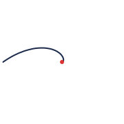 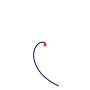 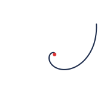

**Test (new):** k = 1 arm at c0 (it ends there) making one loose curl: 0.4 to 1.2 turns and fewer than 8 nested levels in view (tighter, many-level curls are galaxies).

| | fires | does not fire |
|---|---|---|
| 1 | 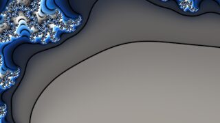 `M6,6-67_2016` k=1 twist=-98° turns=-0.81 levels=3.0 | 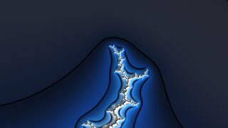 `M5,6-193_1008` k=1 twist=-139° turns=-0.40 levels=1.0 |
| 2 | 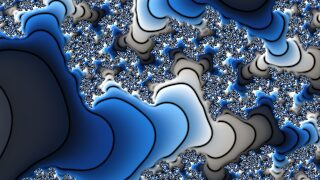 `M5,5-33_496` k=1 twist=-83° turns=-0.79 levels=3.4 | 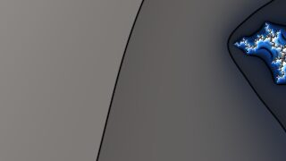 `M5,3-39_112` k=1 twist=-64° turns=-0.40 levels=2.2 |
| 3 | 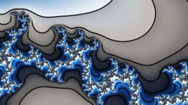 `M6,6-71_2016` k=1 twist=-98° turns=-0.78 levels=2.9 | 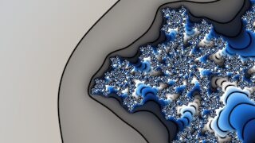 `M14,3-16389_57344` k=1 twist=-61° turns=-1.20 levels=7.1 |
| 4 | 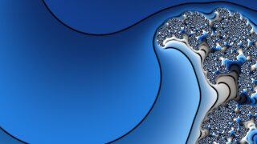 `M8,6-127_8064` k=1 twist=84° turns=0.78 levels=3.3 | 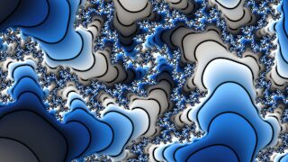 `M6,3-15_224` k=1 twist=60° turns=0.40 levels=2.4 |
| 5 | 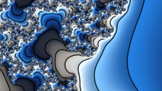 `M5,6-65_1008` k=1 twist=-115° turns=-0.77 levels=2.4 | 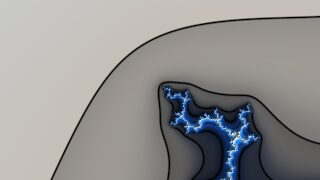 `M6,6-695_2016` k=1 twist=-88° turns=-0.19 levels=0.8 |
| 6 | 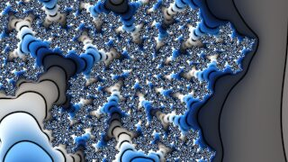 `M12,5-18423_63488` k=1 twist=86° turns=0.83 levels=3.5 | 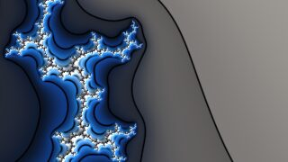 `M5,3-17_112` k=1 twist=16° turns=0.07 levels=1.5 |

## spoke/backbone

**Look for:** ONE or TWO arms that run STRAIGHT into or through the centre: a straight spine or antenna, usually with small side branches along it.

**Not it:** not curling (hook/tendril), not 3+ arms meeting (dendrite).

**Should look like** (schematics from the model, a few variants; red dot = the centre point):

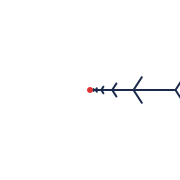 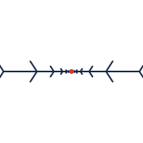 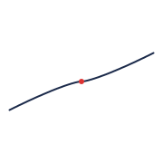

**Test (new):** k <= 2 arms at c0 and they twist < 0.1 turn across the view (a straight spine).

| | fires | does not fire |
|---|---|---|
| 1 | 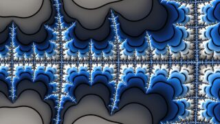 `M5,2-33_80` k=2 twist=-0° turns=-0.00 levels=8.1 | 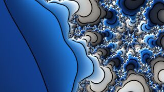 `M6,5-329_992` k=1 twist=29° turns=0.10 levels=1.2 |
| 2 | 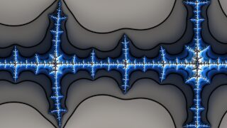 `M5,6-419_1008` k=2 twist=-0° turns=-0.00 levels=2.3 | 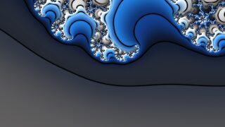 `M6,6-23_2016` k=1 twist=-40° turns=-0.10 levels=0.9 |
| 3 | 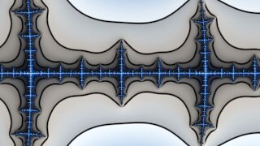 `M3,1-5_12` k=2 twist=0° turns=0.00 levels=8.5 | 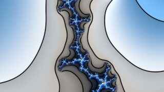 `M6,2-5_96` k=1 twist=15° turns=0.10 levels=2.4 |
| 4 | 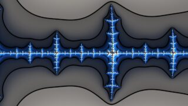 `M6,6-841_2016` k=2 twist=0° turns=0.00 levels=1.9 |  `M6,5-5_992` k=1 twist=33° turns=0.10 levels=1.1 |
| 5 | 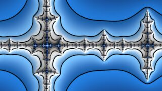 `M4,6-211_504` k=2 twist=0° turns=0.00 levels=1.8 |  `M6,6-949_2016` k=1 twist=-85° turns=-0.19 levels=0.8 |
| 6 | 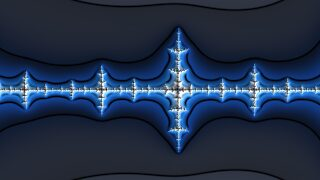 `M6,2-67_160` k=2 twist=0° turns=0.00 levels=5.1 | 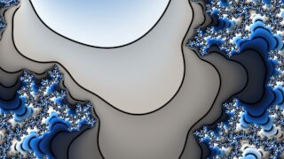 `M6,6-587_2016` k=1 twist=-63° turns=-0.33 levels=1.9 |

## dendrite

**Look for:** THREE OR MORE arms meeting at the centre, all nearly STRAIGHT, like a star, a cross or a branching twig. 3, 4, 5 ... arms all count; what matters is "several straight arms meet here".

**Not it:** not swirling (whirlpool), not just one or two arms (spoke).

**Should look like** (schematics from the model, a few variants; red dot = the centre point):

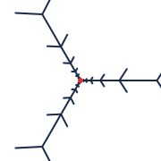 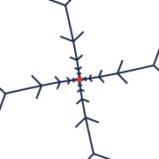 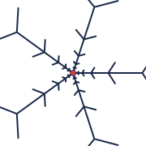

**Test (new):** k >= 3 arms at c0 and they twist < 0.15 turn across the view (non-rotating fork).

| | fires | does not fire |
|---|---|---|
| 1 | 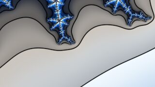 `M4,1-9_56` k=3 twist=-0° turns=-0.02 levels=15.4 |  `M7,1-121_448` k=3 twist=6° turns=0.36 levels=22.2 |
| 2 | 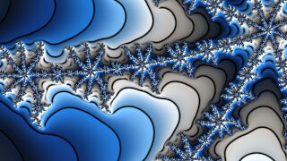 `M5,1-17_240` k=4 twist=-1° turns=-0.04 levels=24.1 | 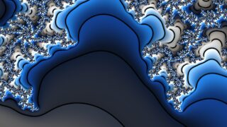 `M9,1-497_3840` k=4 twist=4° turns=0.38 levels=35.9 |
| 3 |  `M5,2-359_1008` k=3 twist=2° turns=0.05 levels=6.8 | 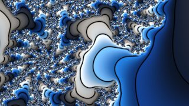 `M11,1-2017_31744` k=5 twist=3° turns=0.38 levels=52.4 |
| 4 |  `M6,2-737_2016` k=3 twist=3° turns=0.06 levels=6.0 | 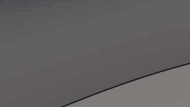 `M13,1-8129_258048` k=6 twist=2° turns=0.38 levels=71.8 |
| 5 |  `M6,1-33_992` k=5 twist=-1° turns=-0.07 levels=34.6 | 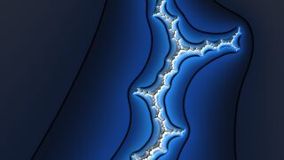 `M5,6-71_336` k=1 twist=-117° turns=-0.34 levels=1.0 |
| 6 | 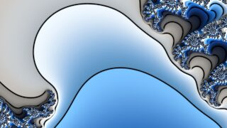 `M7,1-65_4032` k=6 twist=-1° turns=-0.09 levels=46.9 | 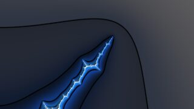 `M4,6-73_168` k=1 twist=88° turns=0.23 levels=0.9 |

## whirlpool

**Look for:** THREE OR MORE arms meeting at the centre, all SWIRLING the same way around it, like water going down a drain or a pinwheel.

**Not it:** not straight arms (dendrite), not just one or two arms (hook/tendril).

**Should look like** (schematics from the model, a few variants; red dot = the centre point):

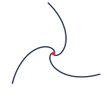 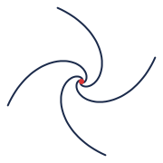 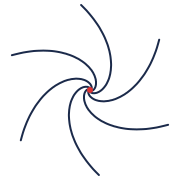

**Test (new):** k >= 3 arms at c0 and they twist >= 0.3 turn across the view.

| | fires | does not fire |
|---|---|---|
| 1 |  `M21,1-1048577_15728640` k=4 twist=-4° turns=-1.36 levels=139.2 | 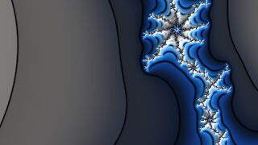 `M6,1-47_480` k=4 twist=3° turns=0.14 levels=18.5 |
| 2 | 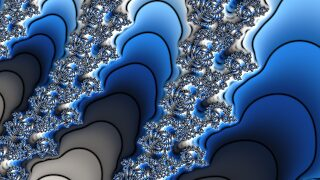 `M22,1-2097153_14680064` k=3 twist=-5° turns=-1.70 levels=127.2 |  `M6,1-37_224` k=3 twist=-4° turns=-0.13 levels=13.3 |
| 3 | 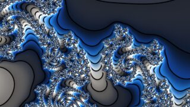 `M19,1-262145_1835008` k=3 twist=-5° turns=-1.45 levels=97.8 | 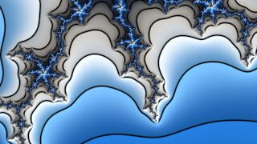 `M6,2-715_2016` k=3 twist=6° turns=0.13 levels=7.7 |
| 4 |  `M19,1-524281_1835008` k=3 twist=5° turns=1.41 levels=93.9 |  `M6,1-51_224` k=3 twist=4° turns=0.13 levels=11.3 |
| 5 |  `M22,1-4194297_14680064` k=3 twist=5° turns=1.66 levels=122.6 | 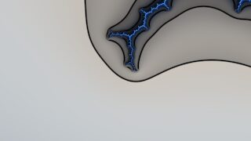 `M4,5-53_248` k=1 twist=79° turns=0.20 levels=0.9 |
| 6 |  `M25,1-33554425_117440512` k=3 twist=4° turns=1.91 levels=155.7 | 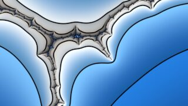 `M6,6-125_288` k=1 twist=83° turns=0.39 levels=1.7 |

## galaxy

**Look for:** A TIGHT spiral wound many times around the centre, with smaller spirals repeating along its arms, like a spiral galaxy. Any number of arms; the many turns and nested repeats matter.

**Not it:** not a single loose curl (hook), not straight arms.

**Should look like** (schematics from the model, a few variants; red dot = the centre point):

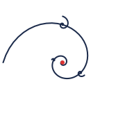 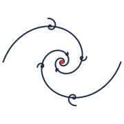 

**Test (new):** >= 15 nested self-similar levels in the view (|lambda| <= 1.34) twisting >= 1 turn.

| | fires | does not fire |
|---|---|---|
| 1 |  `M28,2-134217727_402653184` k=1 twist=24° turns=2.68 levels=40.5 |  `M17,1-131057_983040` k=4 twist=4° turns=0.99 levels=87.8 |
| 2 |  `M27,1-67108865_201326592` k=2 twist=-6° turns=-2.57 levels=145.5 |  `M11,1-1025_3072` k=2 twist=-12° turns=-0.98 levels=29.7 |
| 3 |  `M26,2-33554431_100663296` k=1 twist=25° turns=2.49 levels=35.4 |  `M13,1-4097_28672` k=3 twist=-7° turns=-0.95 levels=51.9 |
| 4 |  `M29,3-536870917_1879048192` k=1 twist=-36° turns=-2.48 levels=25.0 |  `M13,1-8185_28672` k=3 twist=7° turns=0.91 levels=49.4 |
| 5 |  `M25,1-16777217_50331648` k=2 twist=-7° turns=-2.37 levels=125.6 |  `M23,4-2796207_20971520` k=1 twist=35° turns=0.14 levels=1.5 |
| 6 |  `M24,2-8388607_25165824` k=1 twist=27° turns=2.31 levels=30.7 |  `M6,6-341_2016` k=1 twist=130° turns=0.38 levels=1.1 |

## tendril

**Look for:** TWO arms through the centre, both curling, so the strand makes an S or a double curl as it passes through.

**Not it:** not one arm that ends (hook), not a straight line (spoke), not 3+ arms (whirlpool).

**Should look like** (schematics from the model, a few variants; red dot = the centre point):

  

**Test (new):** k = 2 arms at c0 (a strand passing through) twisting >= 1.1 turns across the view: an edge that accumulates rotation without ending (the issue's "double hook").

| | fires | does not fire |
|---|---|---|
| 1 |  `M27,1-67108865_201326592` k=2 twist=-6° turns=-2.57 levels=145.5 |  `M11,1-1025_3072` k=2 twist=-12° turns=-0.98 levels=29.7 |
| 2 |  `M25,1-16777217_50331648` k=2 twist=-7° turns=-2.37 levels=125.6 |  `M9,1-257_768` k=2 twist=-13° turns=-0.78 levels=22.2 |
| 3 |  `M23,1-4194305_12582912` k=2 twist=-7° turns=-2.17 levels=107.2 |  `M7,1-65_192` k=2 twist=-13° turns=-0.56 levels=16.1 |
| 4 |  `M21,1-1048577_3145728` k=2 twist=-8° turns=-1.98 levels=90.4 |  `M6,1-35_96` k=2 twist=-13° turns=-0.36 levels=10.3 |
| 5 |  `M19,1-262145_786432` k=2 twist=-9° turns=-1.78 levels=75.2 |  `M6,6-221_672` k=1 twist=-38° turns=-0.11 levels=1.0 |
| 6 |  `M17,1-65537_196608` k=2 twist=-9° turns=-1.58 levels=61.5 |  `M9,5-2581_7936` k=1 twist=-84° turns=-0.25 levels=1.1 |

## filament

**Not definable yet:** an edge between two forks needs a view framing that edge, and the Tan Lei image of a whole tree edge is too large for the similarity to hold (such views land on bulbs). It needs the tree pulled back to view scale by the cycle's inverse branches: a follow-up.

## spindle

**Not definable yet:** an antenna segment between consecutive minibrots: needs minibrot (hyperbolic component) detection, which MAP-01 adds; between forks alone it is a filament.

## Corpus

Points per arm count: k=1: 1766, k=2: 216, k=3: 20, k=4: 10, k=5: 13, k=6: 5. Points where each test fires: hook: 234, tendril: 8, spoke/backbone: 652, dendrite: 11, whirlpool: 37, galaxy: 36.

Exact decimal centres and widths for every thumbnail are in `views.json`; render any of them with `fd render --re RE --im IM --width W`.

## Established vs new

**Established** (used as is): Hubbard trees as regulated arcs joining the critical orbit (Douady-Hubbard, Orsay notes); the kneading/triod construction of their topology (Bruin-Kaffl-Schleicher 2009, Prop. 3.5); landing of rational parameter rays at Misiurewicz points and transitive rotation of more than one ray at a cycle point (Douady-Hubbard; Milnor, "Periodic orbits, external rays and the Mandelbrot set"); asymptotic similarity of M and J_c0 at a Misiurewicz point (Tan Lei 1990); ray tracing in and out (Heiland-Allen, mandelbrot-numerics). The shape names come from Munafo's Mu-Ency.

**New** (proposals for the owner to judge): every shape test above and its threshold; the *residual twist* (multiplier argument minus the rays' combinatorial rotation) as the visible arm turn per self-similar level; counting turns over a fixed span of levels per view; the zoom rules (centre: Tan Lei image of the distance to the nearest postcritical point;placing tree vertices as triod centres of numerically lifted arcs.

**Not certified:** ray landing is numerical (Newton from the traced ray end, with the arm count checked against Milnor's rule); tree arcs are converged numerically; Tan Lei's similarity is asymptotic (it held in the views checked; edge-scale views did not hold, hence filament).
